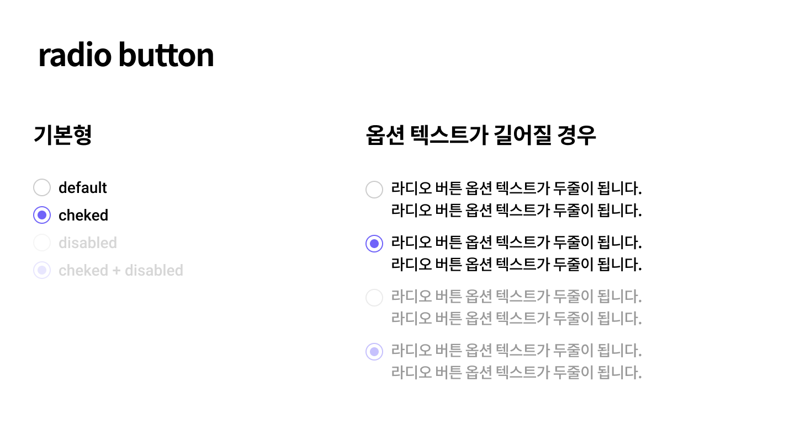

## Case4 : Radio button

### 케이스 주제
Form 요소 중 하나인 라디오 버튼(Radio button) 문제입니다.  
아래 example.png 이미지를 참고해서 라디오 버튼을 구현해주세요.

### 요구사항
1. 브라우저 기본형 라디오 버튼 작성하기
    - default
    - checked 
    - disabled
    - checked + disabled

2. sprite image로 디자인 된 라디오 버튼 구현해보기
    - default
    - checked 
    - disabled
    - checked + disabled

3. 그룹별 라디오 버튼은 disabled 상태를 제외하고 단 한개만 checked 상태가 되어야 한다.
4. 라디오 버튼이 disabled 상태일 때 투명도를 50%로 지정한다.
5. 라디오 버튼의 옵션 텍스트가 길어질 경우 라디오 버튼은 왼쪽 상단에 고정한다.

### example.png

### 학습 키워드
- 라디오버튼의 단일 선택 속성인 name 속성 사용해보기
- 웹접근성을 위한 label 태그의 필수 사용
- 디자인 된 라디오 버튼을 직접 구현해보기

### 작성해주셔야 하는 question 파일경로
`./question/html/raduobutton.html`
`./question/scss/raduobutton.scss`