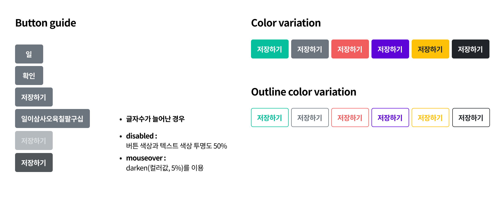

## Case5 : Button

### 케이스 주제

Form 요소 중 하나인 버튼(button) 문제입니다.  
아래 이미지를 참고해서 각 상황/디자인에 맞춰 button을 구현해주세요.

### 기능 요구사항

1. 기본 디자인 정의
   - 버튼의 최소 가로값 56px
   - 고정 높이값 38px (텍스트는 영역 안에서 세로 가운데 정렬)
   - 테두리 라운드 값 4px
   - 버튼 텍스트가 늘어날 경우 좌/우 여백은 12px을 유지한다.
2. 필수 구현 요소
   - mouseover 할 때, darken(색상값, 5%)을 이용하여 hover시 5% 어두워지도록 구현한다.
   - disabled 상태일 때, 투명도를 50%로 구현한다.
3. 색상값 참고
   -  `#6C757D`
   -  `#F15D5D`
   -  `#5D04D9`
   -  `#06BF9D`
   -  `#FFC107`
   -  `#f03c15`
   -  `#212529`
4. color variation을 mixin을 사용하여 구현해보기
   - step1. mixin의 매개변수 값으로 색상값을 지정한다.
   - step2. mixin의 매개변수 값으로 색상값과 outline의 boolean값으로 테두리를 지정한다. 
     참고 : Sass mixin 공식문서 https://sass-lang.com/documentation/at-rules/mixin

### 문제

### 주요 학습 키워드

- 기본 button 요소의 스타일링
- 반복되는 css를 mixin을 사용하여 템플릿화 해보기

### 작성해주셔야 하는 question 파일경로

1. mixin을 사용하지 않은 button 스타일링
   - `./question/html/button.html`
   - `./question/scss/button.scss`
2. mixin을 사용한 button 스타일링
   - `./question/html/button-mixin.html`
   - `./question/scss/button-mixin.scss`

### 실행 방법

#### mixin을 사용하지 않은 button 스타일링

경로
`./question/html`
button.html 열기

#### mixin을 사용한 button 스타일링

경로
`./question/html`
button-mixin.html 열기
