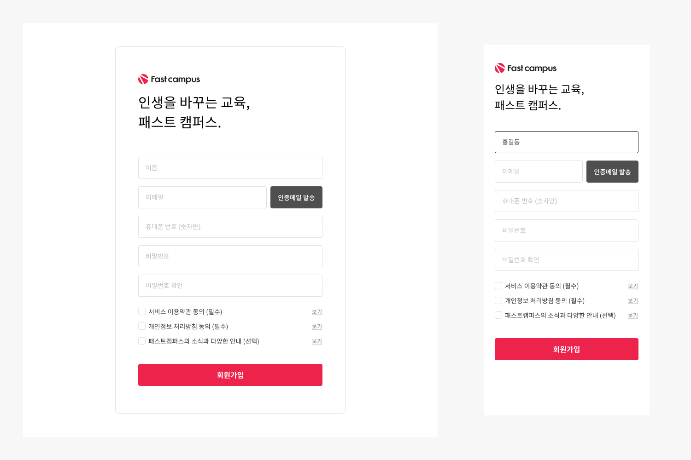

## Case10 : Signup

### 케이스 주제

[Figma](https://www.figma.com/file/9FXkniEMPgZKtJY4GwP60z/SecretCode?node-id=55%3A2)에서 제공되는 수치를 확인해서 디자인과 같은 반응형 UI를 마크업합니다. 
아래의 요구사항을 참고해서 모든 브라우저에서 같은 디자인이 보이도록 해야합니다.

### 기능 요구사항

1. 디자인 가이드를 참고하여 브라우저 사이즈에 따라 적절하게 위치할 수 있는 레이아웃 스타일을 작성해주세요.
   - 브라우저 사이즈에 따라 레이아웃이 변경되는 것을 유의해주세요.
   - media query를 사용하여 반응형 디자인 스타일을 작성해주세요.
2. 디자인 가이드에 따라 컨텐츠를 채워주세요.
3. 디자인 가이드의 수치에 따라 스타일을 작성해주세요.
   - 회원가입 컨테이너의 가로 길이가 브라우저 사이즈에 따라 적절하게 변경될 수 있도록 해주세요.
   - 체크박스 input에서 이미지를 활용하는 것에 유의해주세요.

### 문제

[👩🏻‍🎨 Figma에서 확인하기](https://www.figma.com/file/9FXkniEMPgZKtJY4GwP60z/SecretCode?node-id=55%3A2) 

### 주요 학습 키워드

- 디자인 가이드를 참고하여 스타일 작성하기
- 반응형 스타일 작성하기

### 작성해주셔야 하는 question 파일경로

`./question/question.html`
`./question/question.css`
`./question/question.scss`

### 실행 방법

경로
`./question/question.html`
index.html 열기
