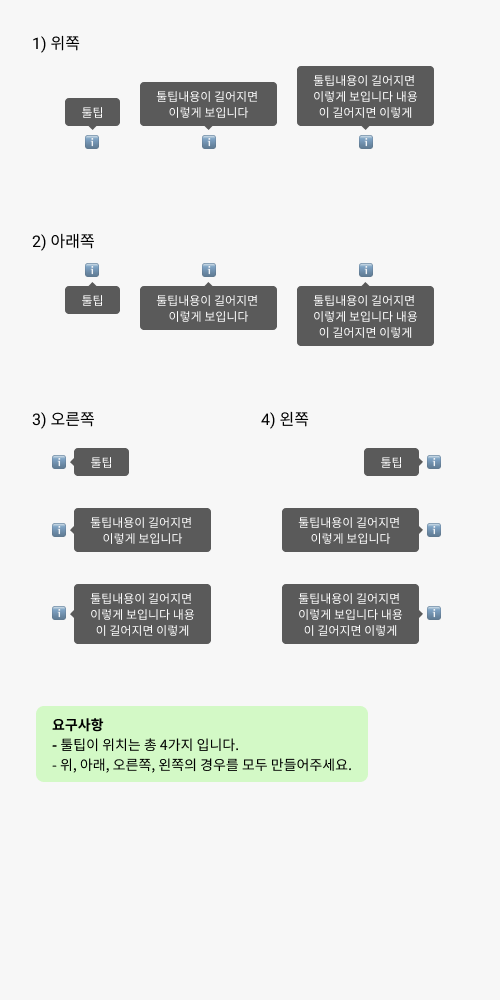

## Case12 : Tooltip

### 케이스 주제

[Figma](https://www.figma.com/file/9FXkniEMPgZKtJY4GwP60z/SecretCode?node-id=55%3A2)에서 제공되는 수치를 확인해서 디자인과 같은 Tooltip을 마크업합니다.

### 기능 요구사항
- 디자인 가이드를 참고하여 스타일 작성하기

### 문제
[👩🏻‍🎨 Figma에서 확인하기](https://www.figma.com/file/9FXkniEMPgZKtJY4GwP60z/SecretCode?node-id=55%3A2) 

### 주요 학습 키워드
- 방향에 따른 마크업변경없는 툴팁 구현하기
- 글자수에 따른 가로영역이 유동적인 툴팁 구현하기

### 작성해주셔야 하는 question 파일경로
`./question/html/tooltip.html`
`./question/scss/tooltip.scss`

### 실행 방법
경로 `./question/html/tooltip.html` tooltip.html 열기