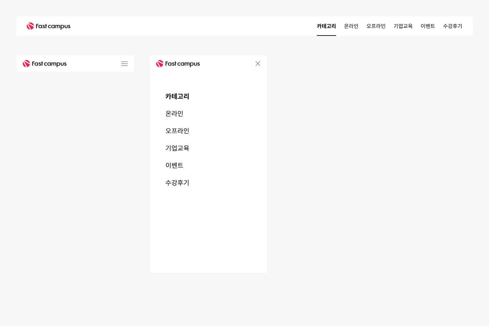
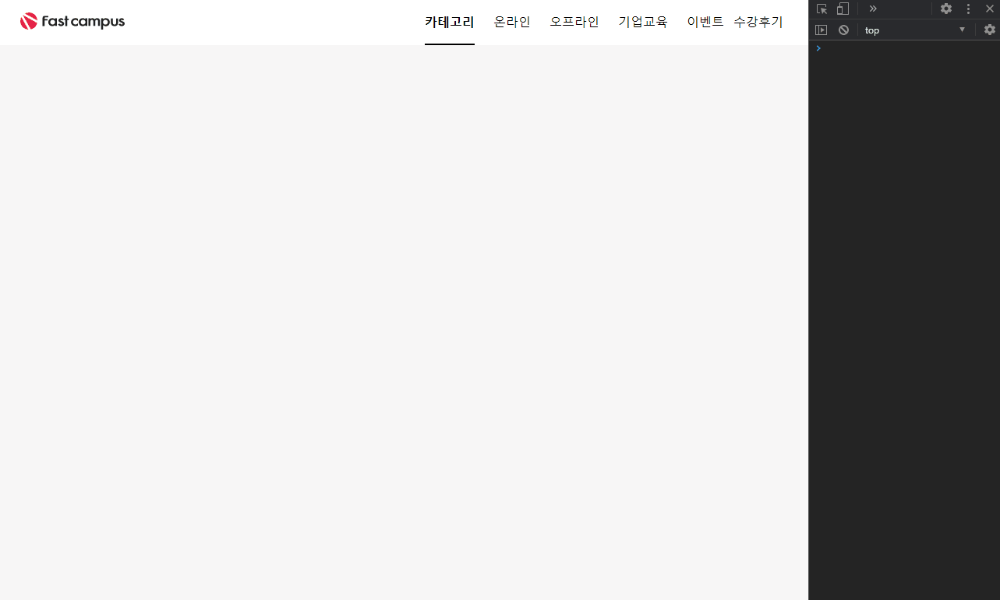

## Case7 : GNB

### 케이스 주제

[Figma](https://www.figma.com/file/9FXkniEMPgZKtJY4GwP60z/SecretCode?node-id=55%3A2)에서 제공되는 수치를 확인해서 디자인과 같은 반응형 UI를 마크업합니다. 
아래의 요구사항을 참고해서 모든 브라우저에서 같은 디자인이 보이도록 해야합니다.

### 기능 요구사항

1. 디자인에 맞추어 GNB를 제작합니다.
2. `_variables.scss`에 사전 정의된 `$breakpoints` map을 활용하여 `_mixins.scss`에 재사용 미디어쿼리 믹스인을 제작합니다.
3. 작성한 믹스인을 바탕으로 반응형을 구현합니다.
4. 네비게이션 토글에 따른 스타일 확인을 위해 question.html 하단에 미리 작성된 스크립트로 넘겨받는  
   `.active` 클래스를 활용합니다.
5. 사용자가 탭 키로 네비게이션을 동작할 수 있도록 웹접근성을 고려해주세요.

### 문제

[👩🏻‍🎨 Figma에서 확인하기](https://www.figma.com/file/9FXkniEMPgZKtJY4GwP60z/SecretCode?node-id=55%3A2) 

### 주요 학습 키워드

- 디자인 가이드를 참고하여 스타일 작성하기
- 반응형 스타일 작성하기

### 작성해주셔야 하는 question 파일경로

`./question/question.html`
`./question/styles/question.scss`
`./question/styles/scss/_mixins_.scss`

### 실행 방법

경로
`./question/question.html`
question.html 열기
