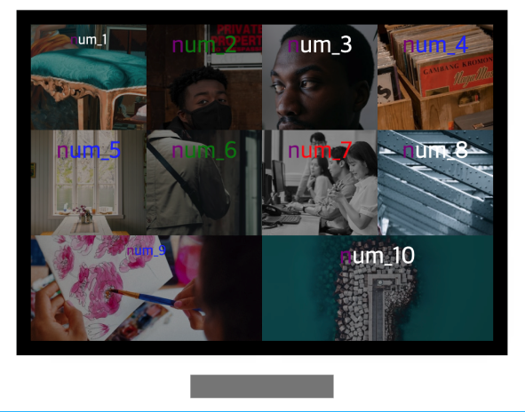

## Case18 : selector

### 케이스 주제

[Figma](https://www.figma.com/file/EXx0G5DbEGHpMJk2WbKqQe/SecretCode-selector?node-id=0%3A1)에서 제공되는 화면을 확인하여 선택자들에 대해서 이해해 봅니다. 
아래의 요구사항을 참고해서 모든 브라우저에서 같은 디자인이 보이도록 해야합니다.

### 기능 요구사항

1. 선택자들에 대해서 이해해 봅니다.
2. 가상 선택자, 가상 엘리먼트, 가상 클래스, ^,\*,$= 등 다양한 선택자를 활용해보세요.
3. target이 blank인 속성만 폰트 사이즈를 30px로 변경해보세요.
4. href가 https로 시작하는 링크에 대해서 파랑색으로 변경해보세요.
5. href에 shit이라는 단어가 포함되어있으면 빨간색으로 변경해보세요. 
   <b>(5번 기능의 자세한 설명(코드)은 case18 출제자 해설 pdf에서 확인바랍니다.)</b> 
6. title이 green으로 시작하는 태그의 다음 자매 요소에 대해서 초록색을 지정해보세요.
7. src가 .jpeg로 끝나는 이미지에 대해서 filter(grascaley)를 `1` 부여해보세요.
8. 첫번째 글자에 대해서 purple 색상을 지정해보세요.
9. 유일한 요소인지 체크하는 only-of-type을 통해 div에 padding을 주고 background를 black으로 지정해보세요.
10. disabled 상태인 input에 background:gray를 주세요.
11. case 16 nth-of-type을 떠올리며 4번째가 아닌 아이템에 대하여 dimmed 효과를 지정해보세요. 
    (강의 순서상 nth-of-type은 case <b>14 => 16</b>번으로 변경되었습니다. 해당 문서를 참고바랍니다.)

### 문제

[👩🏻‍🎨 Figma에서 확인하기](https://www.figma.com/file/EXx0G5DbEGHpMJk2WbKqQe/SecretCode-selector?node-id=0%3A1) 

### 주요 학습 키워드

---

- 다양한 선택자들 이해해보기
- 가상 클래스와 가상 엘리먼트 차이 이해하기
- 실용적으로 선택자 선택하기
- case 16 nth-of-type으로 돌아가서 not 선택자 사용해보기 
  (강의 순서상 nth-of-type은 case <b>14 => 16</b>번으로 변경되었습니다. 해당 문서를 참고바랍니다.)

### 작성해주셔야 하는 question 파일경로

`./question/question.css`
`./question/question.scss`

### 실행 방법

경로
`./question/question.html`
index.html 열기
