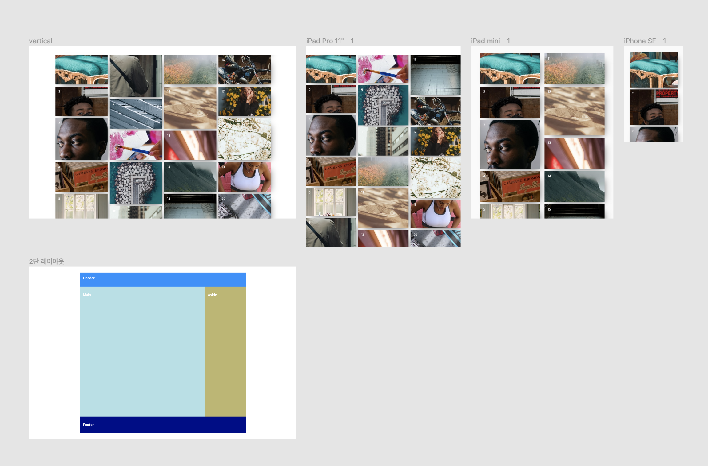

##  Case22 : Grid

### 케이스 주제
[Figma](https://www.figma.com/file/IxWfffu7utsAxukTAuXJpi/SecretCode-Grid?node-id=0%3A1)에서 제공되는 화면을 확인하여 Masonry 갤러리를 만듭니다. 
그리고 2단 레이아웃도 만들어보세요. 
아래의 요구사항을 참고해서 모든 브라우저에서 같은 디자인이 보이도록 해야합니다.

### 기능 요구사항
1. 지정된 브라우저 해상도(table(1024px), pablet(767px), mobile(480px))에 따라서 Masonry 레이아웃을 Grid를 이용하여 구성합니다.
2. 각 박스의 높이는 220px(큰 박스), 140px(작은 박스)가 적절히 섞이도록 구성해야 합니다.
3. grid를 사용하여 적절히 높이를 조절하되 종방향으로 구성합니다.
4. 박스의 순서는 figma를 확인해주세요.
5. Vertical형태를 완료하면 2단 레이아웃도 만들어보세요.
6. 2단 레이아웃의 경우 `display: grid` 속성을 반드시 사용하여서 만들어주세요.
7. 2단 레이아웃 경우 ie10까지도 잘 작동해야 합니다.

### 문제
[👩🏻‍🎨 Figma에서 확인하기](https://www.figma.com/file/IxWfffu7utsAxukTAuXJpi/SecretCode-Grid?node-id=0%3A1) 
 

### 주요 학습 키워드
- grid로 다양한 레이아웃 만들기
- grid로 갤러리 만들기
- grid로 2단 레이아웃 만들기
- grid로 ie를 고려한 레이아웃 만들기

### 작성해주셔야 하는 question 파일경로
`./question/question.html`
`./question/question.css`
`./question/question.scss`

### 실행 방법
경로
`./question/question.html`
index.html 열기