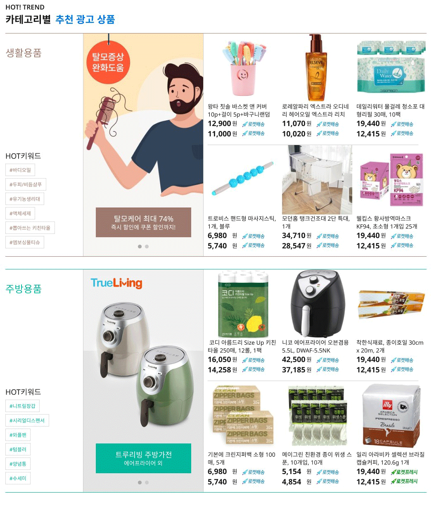

## Case27 : category-item-list

 

### 케이스 주제

[Figma](<https://www.figma.com/file/Cea2jP3BU6UhyMFLy1wIjS/%EC%BF%A0%ED%8C%A1%EC%8B%9C%EC%95%88%EC%9E%91%EC%97%85(%EC%88%98%EC%A0%95)?node-id=237%3A188486>)에서 제공되는 디자인을 확인하여 카테고리 아이템 유닛 리스트 UI를 마크업합니다. 
아래의 요구사항을 참고해서 모든 브라우저에서 같은 디자인이 보이도록 해야합니다.

 

### 기능 요구사항

1. 제공된 마크업 페이지를 사용하여 카테고리 아이템 유닛 리스트 스타일을 작성합니다.
2. `styles/scss/_variable.scss`에 정의된 `$category-colors`에 따라 카테고리 아이템 유닛의 컬러가 적용되도록 합니다.

 

### 문제 및 기능 작동 이미지

[👩🏻‍🎨 Figma에서 확인하기](<https://www.figma.com/file/Cea2jP3BU6UhyMFLy1wIjS/%EC%BF%A0%ED%8C%A1%EC%8B%9C%EC%95%88%EC%9E%91%EC%97%85(%EC%88%98%EC%A0%95)?node-id=237%3A188486>) 

 

### 주요 학습 키워드

- 디자인 가이드를 참고하여 스타일 작성하기
- 다양한 포지션 스타일 속성 적용하기

 

### 작성해주셔야 하는 question 파일경로

`./question/styles/question.scss`

 

### 실행 방법

경로
`./question/question.html`
question.html 열기
