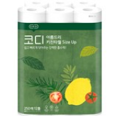

## Case27 : category-item-list - 출제자 해설

```html
<!DOCTYPE html>
<html lang="ko">
  <head>
    <meta charset="UTF-8" />
    <meta http-equiv="X-UA-Compatible" content="IE=edge" />
    <meta name="viewport" content="width=device-width, initial-scale=1.0" />
    <title>카테고리별 추천 광고 상품</title>
    <link rel="stylesheet" href="https://fonts.googleapis.com/css2?family=Noto+Sans+KR:wght@300;400;700&amp;display=swap" />
    <link rel="stylesheet" href="https://cdnjs.cloudflare.com/ajax/libs/Glide.js/3.2.0/css/glide.core.min.css" />
    <link rel="stylesheet" href="styles/solution.css" />
    <script defer src="https://cdnjs.cloudflare.com/ajax/libs/Glide.js/3.2.0/glide.min.js"></script>
    <script defer src="js/main.js"></script>
  </head>
  <body>
    <div class="container">
      <h2 class="section__title"><span class="section__titleCaption">HOT! TREND</span>카테고리별 <em>추천 광고 상품</em></h2>
      <div class="category__unit supplies">
        <div class="category__detail">
          <h3 class="category__title">생활용품</h3>
          <dl class="category__keywords">
            <dt>HOT키워드</dt>
            <dd><a href="#">#바디오일</a><a href="#">#두피/비듬샴푸</a><a href="#">#유기농생리대</a><a href="#">#액체세제</a><a href="#">#뽑아쓰는 키친타올</a></dd>
          </dl>
        </div>
        <div class="category__banner" id="suppliesCarousel">
          <div class="glid__track" data-glide-el="track">
            <ul class="category__bannerList glide__slides">
              <li class="category__bannerItem glide__slide">
                <a href="#"
                  >
                  <div class="category__bannerTitle">
                    <strong>탈모케어 최대 74%</strong>
                    <p>즉시 할인에 쿠폰 할인까지!</p>
                  </div></a
                >
              </li>
              <li class="category__bannerItem glide__slide">
                <a href="#"
                  >
                  <div class="category__bannerTitle">
                    <strong>텍스트가 너비이 넘어가더라도 UI가 깨지지 않게 해주세요.</strong>
                    <p>텍스트가 너비이 넘어가더라도 UI가 깨지지 않게 해주세요.</p>
                  </div></a
                >
              </li>
            </ul>
          </div>
          <div class="glide__bullet" data-glide-el="controls[nav]">
            <li><span class="sr-only">1</span></li>
            <li><span class="sr-only">2</span></li>
          </div>
        </div>
        <div class="category__productList">
          <ul class="productList">
            <li class="productItem">
              <a href="#"
                ><div class="productItem__thumbnail"></div>
                <span class="productItem__title"> 코디 아름드리 Size Up 키친타올 250매, 12롤, 1팩 텍스트가 너비이 넘어가더라도 UI가 깨지지 않게 해주세요.</span><span class="productItem__price"> <strong>16,050</strong>원 </span><span class="productItem__price"> <strong>14,258</strong>원 </span
              ></a>
            </li>
            <li class="productItem">
              <a href="#"
                ><div class="productItem__thumbnail"></div>
                <span class="productItem__title"> 코디 아름드리 Size Up 키친타올 250매, 12롤, 1팩 텍스트가 너비이 넘어가더라도 UI가 깨지지 않게 해주세요.</span><span class="productItem__price"> <strong>16,050</strong>원 </span><span class="productItem__price"> <strong>14,258</strong>원 </span
              ></a>
            </li>
            <li class="productItem">
              <a href="#"
                ><div class="productItem__thumbnail"></div>
                <span class="productItem__title"> 코디 아름드리 Size Up 키친타올 250매, 12롤, 1팩 텍스트가 너비이 넘어가더라도 UI가 깨지지 않게 해주세요.</span><span class="productItem__price"> <strong>16,050</strong>원 </span><span class="productItem__price"> <strong>14,258</strong>원 </span
              ></a>
            </li>
            <li class="productItem">
              <a href="#"
                ><div class="productItem__thumbnail"></div>
                <span class="productItem__title"> 코디 아름드리 Size Up 키친타올 250매, 12롤, 1팩 텍스트가 너비이 넘어가더라도 UI가 깨지지 않게 해주세요.</span><span class="productItem__price"> <strong>16,050</strong>원 </span><span class="productItem__price"> <strong>14,258</strong>원 </span
              ></a>
            </li>
            <li class="productItem">
              <a href="#"
                ><div class="productItem__thumbnail"></div>
                <span class="productItem__title"> 코디 아름드리 Size Up 키친타올 250매, 12롤, 1팩 텍스트가 너비이 넘어가더라도 UI가 깨지지 않게 해주세요.</span><span class="productItem__price"> <strong>16,050</strong>원 </span><span class="productItem__price"> <strong>14,258</strong>원 </span
              ></a>
            </li>
            <li class="productItem">
              <a href="#"
                ><div class="productItem__thumbnail"></div>
                <span class="productItem__title"> 코디 아름드리 Size Up 키친타올 250매, 12롤, 1팩 텍스트가 너비이 넘어가더라도 UI가 깨지지 않게 해주세요.</span><span class="productItem__price"> <strong>16,050</strong>원 </span><span class="productItem__price"> <strong>14,258</strong>원 </span
              ></a>
            </li>
          </ul>
        </div>
      </div>
      <div class="category__unit kitchen">
        <div class="category__detail">
          <h3 class="category__title">주방용품</h3>
          <dl class="category__keywords">
            <dt>HOT키워드</dt>
            <dd><a href="#">#니트릴장갑</a><a href="#">#시리얼디스펜서</a><a href="#">#와플팬</a><a href="#">#텀블러</a><a href="#">#양념통</a><a href="#">#수세미</a></dd>
          </dl>
        </div>
        <div class="category__banner" id="kitchenCarousel">
          <div class="glid__track" data-glide-el="track">
            <ul class="category__bannerList glide__slides">
              <li class="category__bannerItem glide__slide">
                <a href="#"
                  >
                  <div class="category__bannerTitle">
                    <strong>배너 타이틀</strong>
                    <p>배너 서브타이틀</p>
                  </div></a
                >
              </li>
              <li class="category__bannerItem glide__slide">
                <a href="#"
                  >
                  <div class="category__bannerTitle">
                    <strong>배너 타이틀</strong>
                    <p>배너 서브타이틀</p>
                  </div></a
                >
              </li>
              <li class="category__bannerItem glide__slide">
                <a href="#"
                  >
                  <div class="category__bannerTitle">
                    <strong>배너 타이틀</strong>
                    <p>배너 서브타이틀</p>
                  </div></a
                >
              </li>
            </ul>
          </div>
          <div class="glide__bullet" data-glide-el="controls[nav]">
            <li><span class="sr-only">1</span></li>
            <li><span class="sr-only">2</span></li>
            <li><span class="sr-only">3</span></li>
          </div>
        </div>
        <div class="category__productList">
          <ul class="productList">
            <li class="productItem">
              <a href="#"
                ><div class="productItem__thumbnail"></div>
                <span class="productItem__title"> 코디 아름드리 Size Up 키친타올 250매, 12롤, 1팩 텍스트가 너비이 넘어가더라도 UI가 깨지지 않게 해주세요.</span><span class="productItem__price"> <strong>16,050</strong>원 </span><span class="productItem__price"> <strong>14,258</strong>원 </span
              ></a>
            </li>
            <li class="productItem">
              <a href="#"
                ><div class="productItem__thumbnail"></div>
                <span class="productItem__title"> 코디 아름드리 Size Up 키친타올 250매, 12롤, 1팩 텍스트가 너비이 넘어가더라도 UI가 깨지지 않게 해주세요.</span><span class="productItem__price"> <strong>16,050</strong>원 </span><span class="productItem__price"> <strong>14,258</strong>원 </span
              ></a>
            </li>
            <li class="productItem">
              <a href="#"
                ><div class="productItem__thumbnail"></div>
                <span class="productItem__title"> 코디 아름드리 Size Up 키친타올 250매, 12롤, 1팩 텍스트가 너비이 넘어가더라도 UI가 깨지지 않게 해주세요.</span><span class="productItem__price"> <strong>16,050</strong>원 </span><span class="productItem__price"> <strong>14,258</strong>원 </span
              ></a>
            </li>
            <li class="productItem">
              <a href="#"
                ><div class="productItem__thumbnail"></div>
                <span class="productItem__title"> 코디 아름드리 Size Up 키친타올 250매, 12롤, 1팩 텍스트가 너비이 넘어가더라도 UI가 깨지지 않게 해주세요.</span><span class="productItem__price"> <strong>16,050</strong>원 </span><span class="productItem__price"> <strong>14,258</strong>원 </span
              ></a>
            </li>
            <li class="productItem">
              <a href="#"
                ><div class="productItem__thumbnail"></div>
                <span class="productItem__title"> 코디 아름드리 Size Up 키친타올 250매, 12롤, 1팩 텍스트가 너비이 넘어가더라도 UI가 깨지지 않게 해주세요.</span><span class="productItem__price"> <strong>16,050</strong>원 </span><span class="productItem__price"> <strong>14,258</strong>원 </span
              ></a>
            </li>
            <li class="productItem">
              <a href="#"
                ><div class="productItem__thumbnail"></div>
                <span class="productItem__title"> 코디 아름드리 Size Up 키친타올 250매, 12롤, 1팩 텍스트가 너비이 넘어가더라도 UI가 깨지지 않게 해주세요.</span><span class="productItem__price"> <strong>16,050</strong>원 </span><span class="productItem__price"> <strong>14,258</strong>원 </span
              ></a>
            </li>
          </ul>
        </div>
      </div>
    </div>
  </body>
</html>
```

```scss
@import "scss/variables";
@import "scss/mixins";
@import "scss/reset";

// Layout
//––––––––––––––––––––––––––––––––––––––––––––––––––
body {
  color: $gray1;
  font-family: "Noto Sans KR", sans-serif;
}

.container {
  width: 1020px;
  margin: 0 auto;
  padding-bottom: 100px;
}

.section__title {
  margin: 76px 0 22px;
  font-size: 24px;
  font-weight: 600;

  .section__titleCaption {
    display: block;
    margin-bottom: 10px;
    font-size: 16px;
  }

  em {
    color: $primary;
  }
}

// A11y
//––––––––––––––––––––––––––––––––––––––––––––––––––
.sr-only {
  border: 0;
  clip: rect(0 0 0 0);
  height: 1px;
  margin: -1px;
  overflow: hidden;
  padding: 0;
  position: absolute;
  width: 1px;
}

// Carousel
//––––––––––––––––––––––––––––––––––––––––––––––––––
.glide__bullet {
  display: flex;
  justify-content: center;
  z-index: 1;
  position: absolute;
  left: 0;
  right: 0;
  bottom: 19px;

  li {
    width: 9px;
    height: 9px;
    margin: 0 4px;
    border-radius: 50%;
    background-color: $gray5;
    list-style: none;

    &.glide__bullet--active {
      background-color: $gray4;
    }
  }
}

// write your code below.
//––––––––––––––––––––––––––––––––––––––––––––––––––

.category__unit {
  display: flex;
  border-style: solid;
  border-top-width: 1px;
  border-bottom-width: 1px;

  &:not(:first-of-type) {
    margin-top: 30px;
  }
}

@each $name, $color in $category-colors {
  .category__unit.#{$name} {
    border-color: $color;

    .category__title {
      color: $color;
    }
    .category__keywords {
      color: $color;
      a:hover {
        border-color: $color;
        background-color: $color;
      }
    }
    .category__bannerTitle {
      background-color: $color;
    }
  }
}

.category__detail {
  display: flex;
  flex-direction: column;
  justify-content: space-between;
  flex: none;
  width: 190px;
  padding: 29px 0 19px;
}

.category__title {
  font-size: 24px;
}

.category__keywords {
  dt {
    color: $gray1;
    font-size: 18px;
  }
  dd {
    display: flex;
    flex-direction: column;
    align-items: flex-start;
    margin-top: 10px;
  }
  a {
    display: block;
    padding: 6px 10px;
    border: 1px solid $gray5;
    color: inherit;
    font-size: 12px;
    text-decoration: none;
    /* 
      color: inherit 에 대한 설명이 영상에서 빠져있어 추가합니다
      color:inherit 는 상위(부모)엘리먼트의 에서 정해준 색상을 그대로 상속받는다는 의미입니다. 
      .category__keywords {
        color: $color;
      }
      에서 정해준 color 를 그대로 상속받습니다.
    */
    &:hover {
      color: #fff;
    }
    & + a {
      margin-top: 5px;
    }
  }
}
.category__banner {
  flex: none;
  overflow: hidden;
  position: relative;
  width: 290px;
  height: 100%;
  border-left: 1px solid $gray5;
  border-right: 1px solid $gray5;
}
.category__bannerItem {
  position: relative;
  img {
    max-width: 100%;
    max-height: 100%;
  }
}
.category__bannerTitle {
  display: flex;
  flex-direction: column;
  justify-content: center;
  align-items: center;
  position: absolute;
  z-index: 1;
  bottom: 47px;
  left: 30px;
  right: 30px;
  height: 72px;
  padding: 0 10px;
  color: #fff;

  strong {
    @include ellipsis();
    font-size: 18px;
  }
  p {
    @include ellipsis();
    margin-top: 5px;
  }
}
.category__productList {
  flex: auto;
  padding-left: 10px;
}
.productList {
  display: grid;
  grid: repeat(2, 1fr) / repeat(3, 1fr);
  column-gap: 10px;
  height: 100%;
  position: relative;

  // [해설] `::`는 Pseudo-elements에 사용합니다. (e.g. ::before, ::after, ...)
  // Pseudo-classes는 엘리먼트의 특정 부분 엘리먼트를 선택하기 위한 키워드입니다.
  &::before {
    content: "";
    position: absolute;
    top: 50%;
    left: 0;
    right: 0;
    overflow: hidden;
    height: 1px;
    border-top: 1px solid $gray5;
  }
}
.productItem > a {
  color: $gray1;
  font-size: 14px;
  text-decoration: none;

  // [참고해설] `:`는 Pseudo-classes에 사용합니다. (e.g. :hover, :visited, ...)
  // Pseudo-classes는 선택 가능한 엘리먼트의 특정한 상태를 선택하기 위한 키워드입니다.
  // &:hover {
  //   .productItem__title {
  //     text-decoration: underline;
  //   }
  // }
}
.productItem__thumbnail img {
  width: 170px;
  height: 168px;
}
.productItem__title {
  @include ellipsis(2);
  line-height: 19px;
}
.productItem__price {
  display: flex;
  align-items: center;

  strong {
    font-size: 18px;
    font-weight: 700;
    line-height: 25px;
  }
}
```
