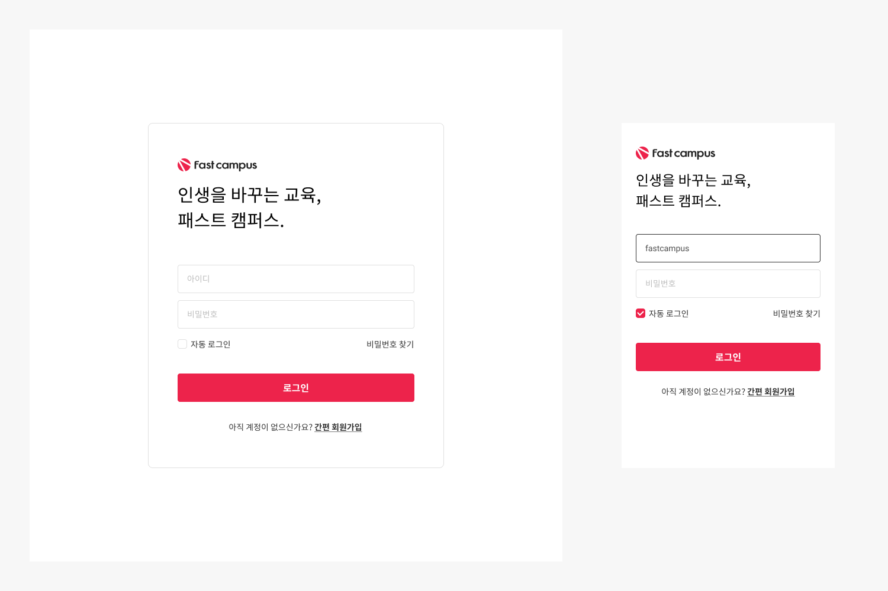

## Case25 : Tailwind CSS Login

### 케이스 주제

[Figma](https://www.figma.com/file/9FXkniEMPgZKtJY4GwP60z/SecretCode?node-id=55%3A2)에서 제공되는 수치를 확인해서 디자인과 같은 반응형 UI를 Tailwind CSS 프레임워크를 사용하여 마크업합니다.<br>
아래의 요구사항을 참고해서 모든 브라우저에서 같은 디자인이 보이도록 해야합니다.

### 기능 요구사항

1. Tailwind CSS 프레임워크를 사용하여 마크업합니다.
2. 디자인 가이드를 참고하여 브라우저 사이즈에 따라 적절하게 위치할 수 있는 레이아웃 스타일을 작성해주세요.
   - 브라우저 사이즈에 따라 레이아웃이 변경되는 것을 유의해주세요.
   - media query를 사용하여 반응형 디자인 스타일을 작성해주세요.
3. 디자인 가이드에 따라 컨텐츠를 채워주세요.
4. 디자인 가이드의 수치에 따라 스타일을 작성해주세요.
   - 로그인 컨테이너의 가로 길이가 브라우저 사이즈에 따라 적절하게 변경될 수 있도록 해주세요.
   - 체크박스 input에서 이미지를 활용하는 것에 유의해주세요.

### 문제

[👩🏻‍🎨 Figma에서 확인하기](https://www.figma.com/file/9FXkniEMPgZKtJY4GwP60z/SecretCode?node-id=55%3A2)<br>


### 주요 학습 키워드

- tailwind css
- 디자인 가이드를 참고하여 스타일 작성하기
- 반응형 스타일 작성하기

### 작성해주셔야 하는 question 파일경로

`./question/index.html`
`./question/styles/tailwind.css`

### 실행 방법

1. npm 설치

경로: `./question` , `./solution`
두 경로에서 모두 실행하시려면 각각 설치하셔야 합니다.
<br />

```shell
$ npm install postcss-cli -g
```

```shell
$ npm install
```

1. CSS 파일 빌드

```shell
$ npm run watch
```

> 위 명령어 사용 시 `tailwind.css` 파일에 작성한 내용이 실시간으로 `style.css` 파일로 빌드됩니다.

3. [Tailwind CSS IntelliSense](https://marketplace.visualstudio.com/items?itemName=bradlc.vscode-tailwindcss) 설치

4. `./question/index.html` 파일 실행
   `./solution/index.html` 파일 실행
