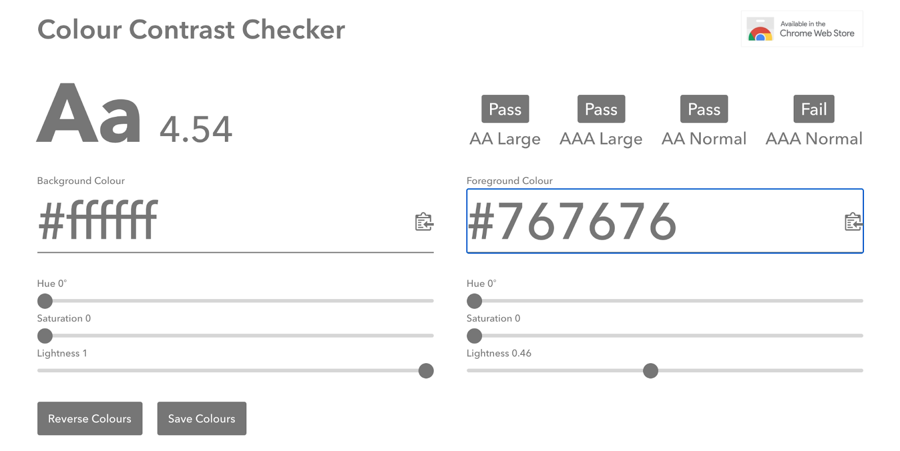
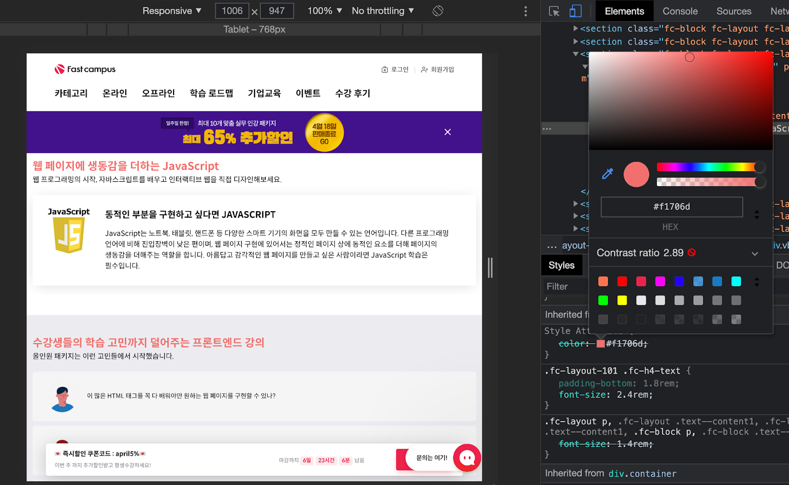

## Case26 : Email template - 출제자 해설코드
```html
<!DOCTYPE html>
<html lang="en">
<head>
    <meta charset="UTF-8">
    <meta name="viewport" content="width=device-width, initial-scale=1.0">
    <title>email (solution)</title>
</head>

<body style="margin: 0; background-color: #f7f7f7;">
<table style="table-layout: fixed; border-collapse: collapse; width: 100%; background-color: #f7f7f7;">
    <tbody>
    <tr>
        <td style="padding: 0; height: 50px;"></td>
    </tr>
    <tr>
        <td style="padding: 0 14px;" align="center">
            <div style="margin: 0 auto; max-width: 520px;">
                <table style="margin: 0 auto; table-layout: fixed; border-collapse: collapse; max-width: 520px; width: 100%; background-color: #fff;">
                    <tr>
                        <td style="padding: 50px 20px; text-align: center;" align="center">
                            <table style="margin: 0; table-layout: fixed; border-collapse: collapse; width: 100%;">
                                <tbody>
                                <tr>
                                <!-- td에는 cellpadding="0" 혹은 style="padding: 0"을 꼭 해주어야 임의 여백이 생기지 않습니다. -->
                                    <td style="padding: 0;" align="center" cellpadding="0">
                                        <!-- 이미지 주소는 꼭 절대경로여야 합니다. -->
                                        

                                        <p style="margin: 40px auto 0; max-width: 420px; font-family: -apple-system, BlinkMacSystemFont, 'Apple SD Gothic Neo', '맑은 고딕', sans-serf; font-size: 24px; font-weight: 700; color: #333; -webkit-text-size-adjust: 100%;">
                                            주문 완료</p>
                                        <p style="margin: 20px auto 0; max-width: 420px; font-family: -apple-system, BlinkMacSystemFont, 'Apple SD Gothic Neo', '맑은 고딕', sans-serf; font-size: 14px; color: #666; word-break: keep-all; line-height: 22px; -webkit-text-size-adjust: 100%;">
                                            홍길동님, 주문해주셔서 감사합니다.<br>
                                            주문하신 <span style="color:#ED234B;">하와이안 피자 R * 12</span>가 주문 완료 되었습니다.<br>
                                            <span style="color:#ED234B;">30분 이내로 배달 완료 예정</span>이니 잠시만 기다려주세요.
                                        </p>
                                    </td>
                                </tr>
                                <tr>
                                    <td style="padding: 32px 0 0;" align="center">
                                        <table style="margin: 0; table-layout: fixed; border-collapse: collapse; max-width: 420px; width: 100%; border-top: 1px solid #ddd; border-bottom: 1px solid #ddd;">
                                            <tbody>
                                            <tr>
                                                <td align="left"
                                                    style="padding: 10px 10px 0; width: 88px; font-family: -apple-system, BlinkMacSystemFont, 'Apple SD Gothic Neo', '맑은 고딕', sans-serf; font-size: 14px; color: #666; line-height: 24px; vertical-align: top;">
                                                    주문자
                                                </td>
                                                <td align="left"
                                                    style="padding: 10px 10px 0; font-family: -apple-system, BlinkMacSystemFont, 'Apple SD Gothic Neo', '맑은 고딕', sans-serf; font-size: 14px; color: #222; line-height: 24px; vertical-align: top;">
                                                    홍길동
                                                </td>
                                            </tr>
                                            <tr>
                                                <td align="left"
                                                    style="padding: 0 10px; width: 88px; font-family: -apple-system, BlinkMacSystemFont, 'Apple SD Gothic Neo', '맑은 고딕', sans-serf; font-size: 14px; color: #666; line-height: 24px; vertical-align: top;">
                                                    연락처
                                                </td>
                                                <td align="left"
                                                    style="padding: 0 10px; font-family: -apple-system, BlinkMacSystemFont, 'Apple SD Gothic Neo', '맑은 고딕', sans-serf; font-size: 14px; color: #222; line-height: 24px; vertical-align: top;">
                                                    010-0000-0000
                                                </td>
                                            </tr>
                                            <tr>
                                                <td align="left"
                                                    style="padding: 0 10px; width: 88px; font-family: -apple-system, BlinkMacSystemFont, 'Apple SD Gothic Neo', '맑은 고딕', sans-serf; font-size: 14px; color: #666; line-height: 24px; vertical-align: top;">
                                                    주문 내용
                                                </td>
                                                <td align="left"
                                                    style="padding: 0 10px; font-family: -apple-system, BlinkMacSystemFont, 'Apple SD Gothic Neo', '맑은 고딕', sans-serf; font-size: 14px; color: #222; line-height: 24px; vertical-align: top;">
                                                    하와이안 피자 R * 12
                                                </td>
                                            </tr>
                                            <tr>
                                                <td align="left"
                                                    style="padding: 0 10px 10px; width: 88px; font-family: -apple-system, BlinkMacSystemFont, 'Apple SD Gothic Neo', '맑은 고딕', sans-serf; font-size: 14px; color: #666; vertical-align: top;">
                                                    베달 예상 시간
                                                </td>
                                                <td align="left"
                                                    style="padding: 0 10px 10px; font-family: -apple-system, BlinkMacSystemFont, 'Apple SD Gothic Neo', '맑은 고딕', sans-serf; font-size: 14px; color: #222; vertical-align: top;">
                                                    30분
                                                </td>
                                            </tr>
                                            </tbody>
                                        </table>
                                    </td>
                                </tr>
                                <tr>
                                    <td style="padding: 40px 0 0; height: 56px" align="center">
                                        <table style="table-layout: fixed; border-collapse: collapse; width: 150px; height: 56px; text-align: center;">
                                            <tbody>
                                            <tr>
                                                <td style="padding: 0; height: 56px; border-radius: 4px; background-color: #ED234B;">
                                                    <a href="https://www.fastcampus.co.kr/" target="_blank"
                                                       style="display: block; margin: 0 auto; padding: 0; width: 150px; height: 56px; line-height: 56px; font-family: -apple-system, BlinkMacSystemFont, 'Apple SD Gothic Neo', '맑은 고딕', sans-serf; font-size: 16px; color: #fff; text-decoration: none;">주문 확인하기</a>
                                                </td>
                                            </tr>
                                            </tbody>
                                        </table>
                                    </td>
                                </tr>
                                </tbody>
                            </table>
                        </td>
                    <tr>
                </table>
            </div>
        </td>
    </tr>
    <tr>
        <td style="padding: 0; height: 50px;"></td>
    </tr>
    </tbody>
</table>
</body>
</html>
```
### < Case26 : Email template > 문제와 같이 보면 좋은 팁 
다른강사님께서 해당 출제문제를 본 후, 같이 확인하면 좋겠다고 주신 의견입니다.

#### HTML
이메일 템플릿을 마크업하는 것은 상당히 많은 제약을 가집니다. 수많은 메일 플랫폼과 메일 뷰어 등이 있기때문입니다. 

제약이 많은 특성상 고려해야 할 점이 많은 이메일 템플릿에 관해 잘 정리되어 있는 사이트를 추천합니다. 아래 사이트를 참고하셔서 이메일 템플릿을 작성해 보시기 바랍니다.

https://heropy.blog/2018/12/30/html-email-template/ 

https://css-tricks.com/html-email-accessibility/

위 블로그에서 이메일 관련 템플릿을 잘 설명하고 있지만 간과하고 있는 부분이 있습니다.
바로 웹접근성에 대한 고려입니다.

일반적인 웹사이트 제작과 마찬가지로 이메일 템플릿 역시 다양한 장애를 고려하여 접근성 높은 템플릿을 개발하는 것이 중요합니다.

그 중 가장 먼저 말씀드릴 부분은 `<table>` 요소에 WAI-ARIA의 role 속성의 값으로 presentation 이나 none을 지정하는 것입니다.

```html
<table role="presentation" border="0" cellspacing="0" cellpadding="0" width="100%">
 ...
</table>
 
<table role="none" border="0" cellspacing="0" cellpadding="0" width="100%">
   ...
</table>
```
https://developer.mozilla.org/en-US/docs/Web/Accessibility/ARIA/ARIA_Techniques/Using_the_presentation_role
https://www.digitala11y.com/none-role/ 

role=”presentation”이나 role=”none”은 `<table>` 요소가 더이상 데이터 테이블로 인식되지 않도록 합니다.

이메일 템플릿에 사용된 `<table>`은 레이아웃 용도로 사용되었기 때문입니다.

두번째로 이미지의 대체텍스트 입니다. 역시 웹접근성 관점에서 가장 기본적이면서 가장 중요한 문제이기 때문에 이메일 템플릿에 사용되는 이미지 역시 이를 고려하는 것이 무엇보다 중요합니다.

대체 텍스트는 `` 요소에 alt 속성을 사용하여 제공할 수 있습니다. 
다만 의미가 없는 장식용 이미지의 경우 alt=””형태로 제공하여 스크린리더가 해당 이미지를 읽지 않을 수 있도록 할 수 있습니다.


이미지에 관한 대체텍스트는 아래 예시를 참고하시기 바랍니다.
https://www.w3.org/WAI/tutorials/images/decorative/ 


#### CSS
HTML에서 웹접근성을 고려해야 하는 것처럼 이메일 템플릿의 CSS 관점에서도 웹접근성에 대한 고려가 필요합니다.

가장 먼저 얘기할 것은 명도대비 입니다.

시각 장애의 경우 전맹만이 아닌 저시력도 존재합니다. 실제 전세계 인구 중 저시력의 비율이 전맹에 비해 월등하게 많습니다. 또한 노화를 겪으면서 자연스럽게 따라오는 저시력은 소수만의 문제가 아닌 모두가 겪을 수 있는 가까운 미래의 문제이기 때문입니다. 

WCAG(Web Content Accessibility Guidelines)에서는 AA 기준 명도 대비를 4.5대 1을 준수할 것을 요청하고 있습니다. 4.5대 1 기준으로 배경색상이 #ffffff 일 때 허용 가능한 전경색상은 #767676 입니다.


https://colourcontrast.cc/ 에서 명도대비를 확인해볼 수 있습니다.

크롬 개발자 도구에서도 명도대비 확인 및 추천 색상을 확인할 수 있습니다.


아래 이메일 템플릿에서 명도 대배가 중요한 이유에 대해 살펴보시기 바랍니다.
https://www.emailonacid.com/blog/article/email-development/why-email-colors-matter/ 

글자크기의 경우 최소 14px을 권장합니다. 글자 크기가 14px 미만일 경우 사람들이 읽기 어려울 수 있습니다. 그러나 이것은 일반적인 규칙일 뿐이며 사용중인 글자 색상이나 글꼴 유형에 따라 다소 차이가 있을 수 있습니다.

예를 들어 밝은 글자 색상의 경우 글자 크기를 최소 16px까지 높이는 것이 좋습니다.
정답이 있을 수는 없겠지만 다양한 환경과 다양한 사람들이 이메일 정보를 쉽게 접근하고 이해할 수 있도록 고민하는 것은 의미 있는 일일 것입니다.

https://webdesign.tutsplus.com/tutorials/a-beginners-guide-to-email-accessibility--cms-31240 

https://www.mailgun.com/blog/email-safe-fonts-typography-improving-accessibility-emails/ 

https://chamaileon.io/resources/email-accessibility-designing-and-coding-accessible-emails/ 
