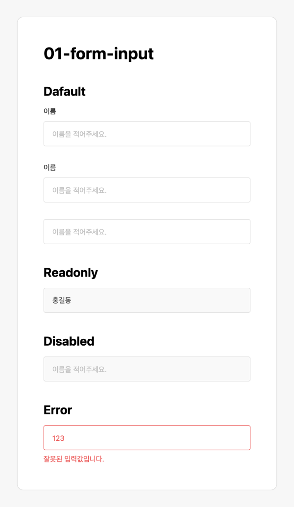

## Case1 : Input 

### 케이스 주제
Form 요소 중 가장 기초가 되는 input 스타일링 문제입니다. 
[Figma](https://www.figma.com/file/9FXkniEMPgZKtJY4GwP60z/Input?node-id=0%3A1)에서 제공되는 수치를 확인해서 디자인과 같은 스타일을 작성합니다. 
아래의 요구사항을 참고해서 모든 브라우저에서 같은 디자인이 보이도록 해야합니다.

 

### 기능 요구사항
1. 기본 `input` 스타일을 작성해주세요.
    - `label`과 `input`을 연결해주세요.
    - `placeholder` 색과 `value` 텍스트 색상을 디자인처럼 각각 다른 색으로 적용해주세요.
1. `hover`했을 경우 테두리색이 변경됩니다.
    - readonly, disabled 일 때는 hover가 되더라도 스타일이 변경되지 않도록 해주세요.
1. `focus`되었을 경우 테두리색이 변경됩니다. 
    - readonly, disabled 일 때는 focus가 되더라도 스타일이 변경되지 않도록 해주세요.
1. `readonly`의 경우 배경색이 바뀝니다.
1. `disabled`의 경우 배경색과 글자색이 바뀝니다.
1. `error` 상태의 경우 `input`에 `error` 클래스명을 추가하면 테두리색, 글자색이 바뀌고
 에러메시지가 보이도록 합니다.

 

### 문제
[👩🏻‍🎨 Figma에서 확인하기](https://www.figma.com/file/9FXkniEMPgZKtJY4GwP60z/Input?node-id=0%3A1) 
 

 

### 주요 학습 키워드
- 크로스브라우징을 고려한 input 스타일 적용
- input과 label로 연결시켜 웹접근성 고려하기
- input의 기본적인 속성들 사용해보기

 

### 작성해주셔야 하는 question 파일경로
`./question/question.html`
`./question/question.scss`

 

### 실행 방법
경로
`./question/question.html`
question.html 열기
