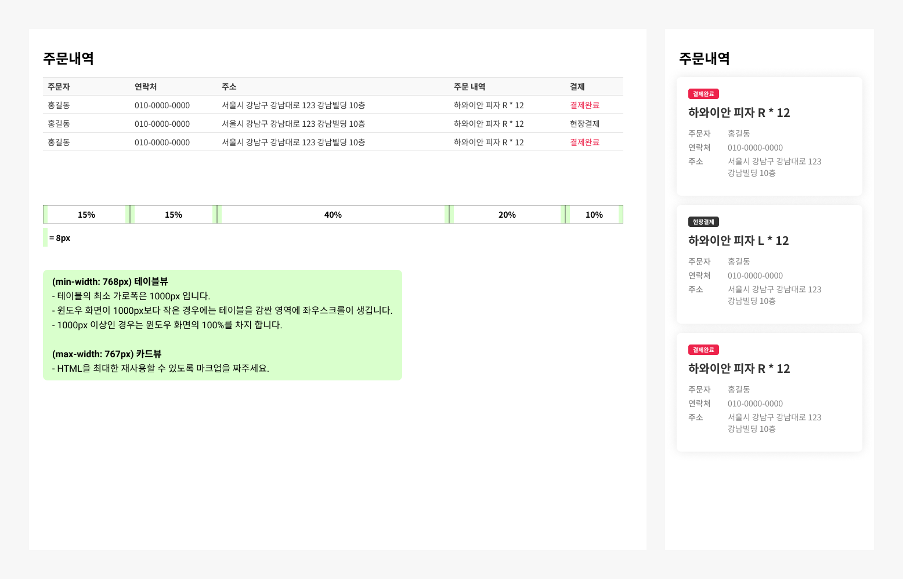

## Case13 : Table and Card

### 케이스 주제
반응형으로 전혀 다른 모양의 컴포넌트를 구현할 수 있는 케이스입니다. 
하나의 마크업(HTML)으로 모바일에서는 카드, 모바일 외에서는 테이블로 보이도록 만듭니다. 

[Figma](https://www.figma.com/file/9FXkniEMPgZKtJY4GwP60z/SecretCode?node-id=143%3A95)에서 제공되는 수치를 확인해서 디자인과 같은 스타일을 작성합니다. 
아래의 요구사항을 참고해서 모든 브라우저에서 같은 디자인이 보이도록 해야합니다.

 

### 기능 요구사항
- (max-width: 767px) 카드뷰
    - HTML을 최대한 재사용할 수 있도록 마크업을 짜주세요.
- (min-width: 768px) 테이블뷰
    - 테이블의 최소 가로폭은 1000px 입니다.
    - 윈도우 화면이 1000px보다 작은 경우에는 테이블을 감싼 영역에 좌우스크롤이 생깁니다.
    - 1000px 이상인 경우는 윈도우 화면의 100%를 차지 합니다.

 

### 문제
[👩🏻‍🎨 Figma에서 확인하기](https://www.figma.com/file/9FXkniEMPgZKtJY4GwP60z/SecretCode?node-id=143%3A95) 
 

 

### 주요 학습 키워드
- 반응형에 따른 디자인 변화
- flex의 order를 활용한 순서 제어
- content: attr(data-attr) 활용

 

### 작성해주셔야 하는 question 파일경로
`./question/question.html`
`./question/question.scss`

 

### 실행 방법
경로 `./question/question.html` question.html 열기
