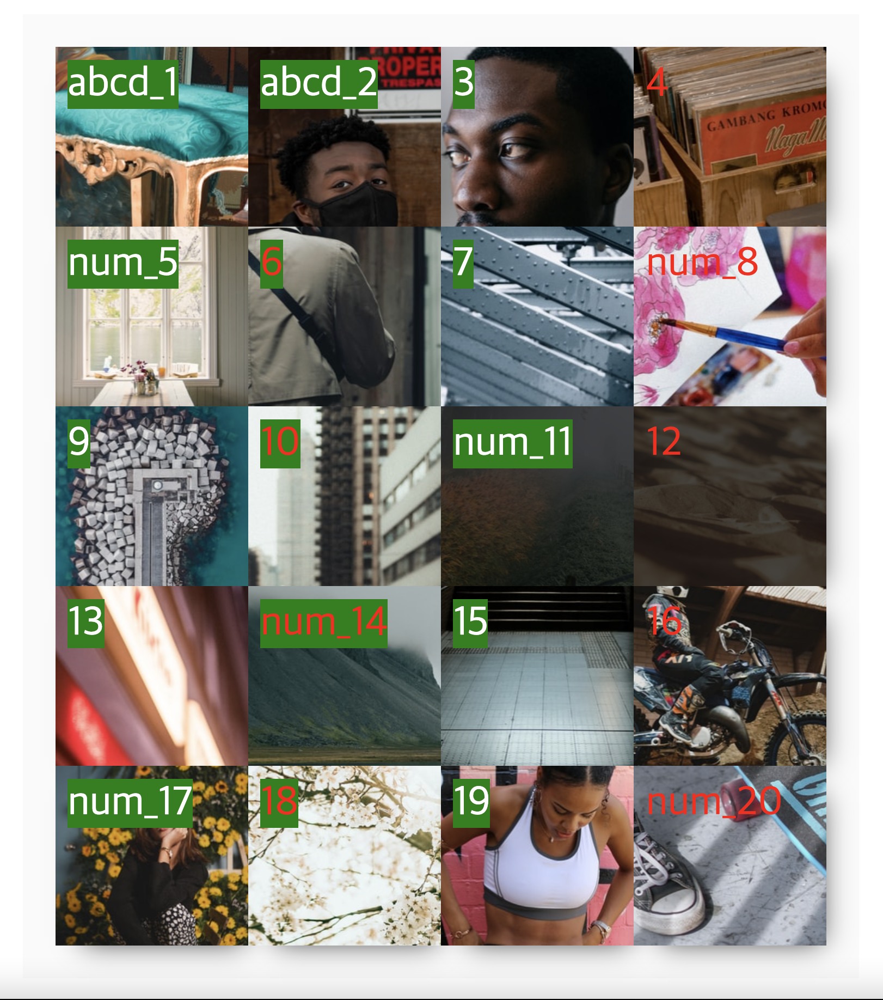

## Case16 : nth-of-type

### 케이스 주제

[Figma](https://www.figma.com/file/5o35TWsiXoCu0eGL6ed8cW/SecretCode-nth-of-type?node-id=0%3A1)에서 제공되는 화면을 확인하여 nth-of-type에 대하여 이해해 봅니다. 
아래의 요구사항을 참고해서 모든 브라우저에서 같은 디자인이 보이도록 해야합니다.

### 기능 요구사항

1. 레이아웃을 잡는 속성은 float을 사용해주세요.
2. 박스의 순서는 figma를 확인해주세요.
3. 이미지와 같이 스타일링 해주세요
   1. 4번째부터 시작하여 2번째마다 컬러를 red로 지정해주세요. (4,6,8,10,12...)
   2. 4번째마다를 제외하고 모든 숫자에 green 배경색을 지정해주세요. (1,2,3,5,6,7,9...)
   3. 2번째부터 3번째마다 content를 'num\_숫자'로 텍스트를 지정 해주세요.ex) 1, 2... => num_1, num_2 (2,5,8,11,14...)
   4. 첫번째 2아이템에 대하여 content를 'abcd\_숫자'로 텍스트를 지정해주세요. ('abcd_1', 'abcd_2',3,4)
   5. nth-of-type을 사용하여 11번째, 12번째 이미지 위에 dimmed효과(background: rgba(0,0,0,0.7))를 적용해보세요. (숫자의 위치에 영향이 없도록 구성해주세요.)

### 문제

[👩🏻‍🎨 Figma에서 확인하기](https://www.figma.com/file/5o35TWsiXoCu0eGL6ed8cW/SecretCode-nth-of-type?node-id=0%3A1) 

### 주요 학습 키워드

- nth-of-type 이해하기
- nth-of-type을 사용해서 다양한 효과 적용해보기
- nth-of-type을 수식 사용해보기
- nth-of-type과 nth-child 차이 이해하기

### 작성해주셔야 하는 question 파일경로

`./question/question.css`
`./question/question.scss`

### 실행 방법

경로
`./question/question.html`
index.html 열기
