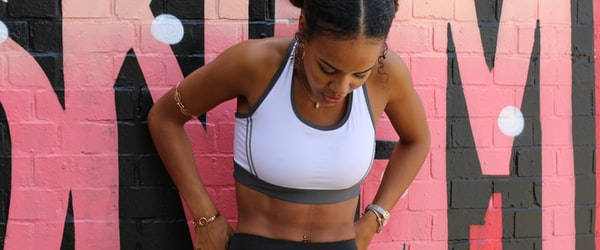

## Case17 : nth-child - 출제자 해설

```html
<!DOCTYPE html>
<html lang="ko">
  <head>
    <meta charset="UTF-8" />
    <meta
      name="viewport"
      content="width=device-width, initial-scale=1.0, user-scalable=no, viewport-fit=cover"
    />
    <title>02-nth-child</title>
    <link rel="stylesheet" href="question.css" />
  </head>

  <body>
    <h1>nth-child</h1>
    <div class="nth-child_wrap">
      <div class="item"></div>
      <span class="item"></span>
      <div class="item"></div>
      <span class="item"></span>
      <span class="item"></span>
      <div class="item"></div>
      <span class="item"></span>
      <span class="item"></span>
      <span class="item"></span>
      <span class="item"></span>
      <span class="item"></span>
      <span class="item"></span>
      <span class="item"></span>
      <span class="item"></span>
      <span class="item"></span>
      <span class="item"></span>
      <span class="item"></span>
      <span class="item"></span>
      <span class="item"></span>
      <span class="item"></span>
    </div>
  </body>
</html>
```

```css
@charset "UTF-8";

/* reset */

*,
*:before,
*:after {
  margin: 0;
  padding: 0;
  border: 0;
  box-sizing: border-box;
}

*:focus {
  outline: none;
}

html,
body {
  position: relative;
  width: 100%;
  height: 100%;
  padding: 0;
  margin: 0;
}

img {
  display: block;
}

h1 {
  text-align: center;
  margin: 35px auto 0;
}

.nth-child_wrap {
  width: 100%;
  max-width: 1024px;
  margin: 40px auto;
  padding: 40px;
  background-color: #fafafa;
  counter-reset: items;
  /* type here */
}

.nth-child_wrap::after {
  content: "";
  display: block;
  clear: both;
}

.nth-child_wrap .item {
  position: relative;
  height: 220px;
  margin-left: 10px;
  margin-bottom: 10px;
  padding: 15px;
  box-shadow: 14px 17px 34px -20px rgba(0, 0, 0, 0.75);
  color: #000;
  box-sizing: border-box;
  overflow: hidden;
  background-color: rgba(0, 0, 0, 0.3);
  width: calc(100% / 4 - (10px / 4) * 3);
  /* type here */
  display: block;
  float: left;
  /* type here */
  /* 4번째부터 시작하여 2번째마다 컬러를 red로 지정해주세요. (4,6,8,10,12...) */
  /* 첫번째 요소부터 5번째 요소까지 2개 마다 content를 'num_숫자'로 텍스트를 지정해주세요. ('num_1', 2,'num_3',4,'num_5',6...) */
  /* 4번째 이미지에 대해서 nth-child로 dimmed를 적용해주시고 5번째 이미지에 대해서 nth-of-type을 사용해서 dimmed]를 적용해주세요. (background: rgba(0,0,0,0.7)) */
  /* 선택자 결합을 통해서 교집합을 만들어 11번부터 15번까지 image에 opacity:0.2를 주세요 */
}

.nth-child_wrap .item:nth-child(4n-3) {
  margin-left: 0;
}

.nth-child_wrap .item img {
  position: absolute;
  left: 50%;
  top: 50%;
  -webkit-transform: translate3d(-50%, -50%, 0);
  transform: translate3d(-50%, -50%, 0);
}

.nth-child_wrap .item:before {
  counter-increment: items;
  content: counter(items);
  position: relative;
  z-index: 1;
  color: #fff;
  font-size: 50px;
}

.nth-child_wrap .item:nth-child(2n + 4):before {
  color: red;
}

.nth-child_wrap .item:nth-child(-2n + 5):before {
  content: "num_" counter(items);
}

.nth-child_wrap .item:nth-child(4):after {
  content: "";
  display: block;
  position: absolute;
  left: 0;
  top: 0;
  width: 100%;
  height: 100%;
  background: rgba(0, 0, 0, 0.7);
}

span.item:nth-of-type(3):after {
  content: "";
  display: block;
  position: absolute;
  left: 0;
  top: 0;
  width: 100%;
  height: 100%;
  background: rgba(0, 0, 0, 0.7);
}

.nth-child_wrap .item:nth-child(n + 11):nth-child(-n + 15) {
  opacity: 0.2;
}

@media (max-width: 1024px) {
  .nth-child_wrap .item {
    width: calc(100% / 3 - (10px / 3) * 2);
  }
  .nth-child_wrap .item:nth-child(4n-3) {
    margin-left: 10px;
  }
  .nth-child_wrap .item:nth-child(3n-2) {
    margin-left: 0;
  }
}

@media (max-width: 767px) {
  .nth-child_wrap .item {
    width: calc(100% / 2 - (10px / 2) * 1);
  }
  .nth-child_wrap .item:nth-child(3n-2) {
    margin-left: 10px;
  }
  .nth-child_wrap .item:nth-child(2n-1) {
    margin-left: 0;
  }
}

@media (max-width: 480px) {
  .nth-child_wrap .item {
    width: 100%;
  }
  .nth-child_wrap .item:nth-child(2n) {
    margin-left: 0;
  }
}
```

```scss
@charset "utf-8";

/* variables */

$w100: 100%;
$half: 50%;
$item_height: 220px;
$basis_space: 40px;
$item_space: 10px;
$padding: 15px;
$box-shadow: 14px 17px 34px -20px rgba(0, 0, 0, 0.75);
$dimmed: rgba(0, 0, 0, 0.7);
$platform_tablet: 1024px;
$platform_pablet: 767px;
$platform_mobile: 480px;

/* reset */

*,
*:before,
*:after {
  margin: 0;
  padding: 0;
  border: 0;
  box-sizing: border-box;
}

*:focus {
  outline: none;
}

html,
body {
  position: relative;
  width: $w100;
  height: $w100;
  padding: 0;
  margin: 0;
}

img {
  display: block;
}

h1 {
  text-align: center;
  margin: 35px auto 0;
}

.nth-child_wrap {
  width: $w100;
  max-width: 1024px;
  margin: $basis_space auto;
  padding: $basis_space;
  background-color: #fafafa;
  counter-reset: items;
  &::after {
    content: "";
    display: block;
    clear: both;
  }
  .item {
    position: relative;
    height: $item_height;
    margin-left: $item_space;
    margin-bottom: $item_space;
    padding: $padding;
    -webkit-box-shadow: $box-shadow;
    box-shadow: $box-shadow;
    color: #000;
    box-sizing: border-box;
    overflow: hidden;
    background-color: rgba(0, 0, 0, 0.3);
    width: calc(#{$w100} / 4 - (#{$item_space} / 4) * 3);
    &:nth-child(4n-3) {
      margin-left: 0;
    }
    /* type here */
    display: block;
    float: left;
    img {
      position: absolute;
      left: $half;
      top: $half;
      -webkit-transform: translate3d(-$half, -$half, 0);
      transform: translate3d(-$half, -$half, 0);
    }
    &:before {
      counter-increment: items;
      content: counter(items);
      position: relative;
      z-index: 1;
      color: #fff;
      font-size: 50px;
    }
    /* type here */
    /* 4번째부터 시작하여 2번째마다 컬러를 red로 지정해주세요. (4,6,8,10,12...) */
    &:nth-child(2n + 4) {
      &:before {
        color: red;
      }
    }
    // &:nth-of-type(2n + 4) {
    //     &:before {
    //         color: red;
    //     }
    // }
    /* 첫번째 요소부터 5번째 요소까지 2개 마다 content를 'num_숫자'로 텍스트를 지정해주세요. ('num_1', 2,'num_3',4,'num_5',6...) */
    &:nth-child(-2n + 5) {
      &:before {
        content: "num_" counter(items);
      }
    }
    // &:nth-of-type(-2n + 5) {
    //     &:before {
    //         content: 'num_'counter(items);
    //     }
    // }
    /* 4번째 이미지에 대해서 nth-child로 dimmed를 적용해주시고 5번째 이미지에 대해서 nth-of-type을 사용해서 dimmed]를 적용해주세요. (background: rgba(0,0,0,0.7)) */
    &:nth-child(4) {
      &:after {
        content: "";
        display: block;
        position: absolute;
        left: 0;
        top: 0;
        width: 100%;
        height: 100%;
        background: rgba(0, 0, 0, 0.7);
      }
    }
    @at-root {
      span.item:nth-of-type(3) {
        &:after {
          content: "";
          display: block;
          position: absolute;
          left: 0;
          top: 0;
          width: 100%;
          height: 100%;
          background: rgba(0, 0, 0, 0.7);
        }
      }
    }
    /* 선택자 결합을 통해서 교집합을 만들어 11번부터 15번까지 image에 opacity:0.2를 주세요 */
    &:nth-child(n + 11):nth-child(-n + 15) {
      opacity: 0.2;
    }
  }
  /* type here */
  @media (max-width: $platform_tablet) {
    .item {
      width: calc(#{$w100} / 3 - (#{$item_space} / 3) * 2);
      &:nth-child(4n-3) {
        margin-left: $item_space;
      }
      &:nth-child(3n-2) {
        margin-left: 0;
      }
    }
  }
  @media (max-width: $platform_pablet) {
    .item {
      width: calc(#{$w100} / 2 - (#{$item_space} / 2) * 1);
      &:nth-child(3n-2) {
        margin-left: $item_space;
      }
      &:nth-child(2n-1) {
        margin-left: 0;
      }
    }
  }
  @media (max-width: $platform_mobile) {
    .item {
      width: $w100;
      &:nth-child(2n) {
        margin-left: 0;
      }
    }
  }
}
```
