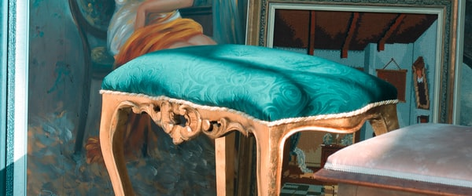

## Case19 : Position - 출제자 해설코드

```html
<!DOCTYPE html>
<html lang="en">
<head>
    <meta charset="UTF-8">
    <meta name="viewport" content="width=device-width, initial-scale=1.0">
    <title>4-2 Position (solution)</title>
    <link rel="stylesheet" href="solution.css">
</head>
<body>
   <h1>position</h1>
    <div class="position_wrap">
        <div class="item_relative">
            <span class="item_absolute"></span>
            <span class="item_absolute"></span>
            <span class="item_absolute"></span>
            <span class="item_absolute"></span>
        </div>
        <div class="item_sticky">
            
        </div>
        <div class="item_relative">
            <span class="item_absolute"></span>
            <span class="item_absolute"></span>
            <span class="item_absolute"></span>
            <span class="item_absolute"></span>
        </div>
        <div class="item_relative">
            <span class="item_absolute"></span>
            <span class="item_absolute"></span>
            <span class="item_absolute"></span>
            <span class="item_absolute"></span>
        </div>
        <div class="item_fixed">
            
        </div>
        <div class="item_static">
            
        </div>
    </div>
</body>
</html>
```

```scss
@charset "utf-8";

/* variables */

$w100: 100%;
$half: 50%;
$basis_space: 40px;

/* reset */

*,
*:before,
*:after {
    box-sizing: border-box;
}

*:focus {
    outline: none;
}

html,
body {
    position: relative;
    width: $w100;
    height: $w100;
    padding: 0;
    margin: 0;
}

h1 {
    text-align: center;
    margin: 35px auto 0;
}

img {
    display: block;
    max-width: 100%;
}

.position_wrap {
    display: block;
    position: relative;
    width: $w100;
    height: 1950px;
    max-width: 1024px;
    margin: $basis_space auto;
    padding: $basis_space;
    background-color: #fafafa;
    *:before {
        content: 'static';
        display: block;
        position: absolute;
        color: #fff;
        font-size: 30px;
        padding: 10px;
        text-shadow: 1px 1px 1px rgba(0, 0, 0, .9);
    }
    .item_relative {
        padding-bottom: 41.25%;
        position: relative;
        top: 10px;
        &:before {
            content: 'relative';
        }
    }
    .item_absolute {
        position: absolute;
        left: 0;
        top: 0;
        width: 50%;
        &:before {
            content: 'absolute';
        }
        &:nth-of-type(2) {
            left: auto;
            right: 0;
            top: 0;
            bottom: auto;
            &:before { 
                content: 'absolute2';
            }
        }
        &:nth-of-type(3) {
            left: 0;
            right: auto;
            bottom: 0;
            top: auto;
            z-index: 1;
            &:before {
                content: 'absolute3';
            }
        }
        &:nth-of-type(4) {
            top: auto;
            right: 0;
            bottom: 0;
            left: auto;
            &:before {
                content: 'absolute4';
            }
        }
    }
    .item_static {
        position: static;
    }
    .item_fixed {
        position: fixed;
        left: 0;
        top: 50%;
        height: 150px;
        margin-top: -75px;
        opacity: .7;
        img {
            height: 100%;
        }
        &:before {
            content: 'fixed';
        }
    }
    .item_sticky {
        position: sticky;
        top: 0;
        left: 0;
        z-index: 1;
        &:before {
            content: 'sticky';
        }
    }
}
```