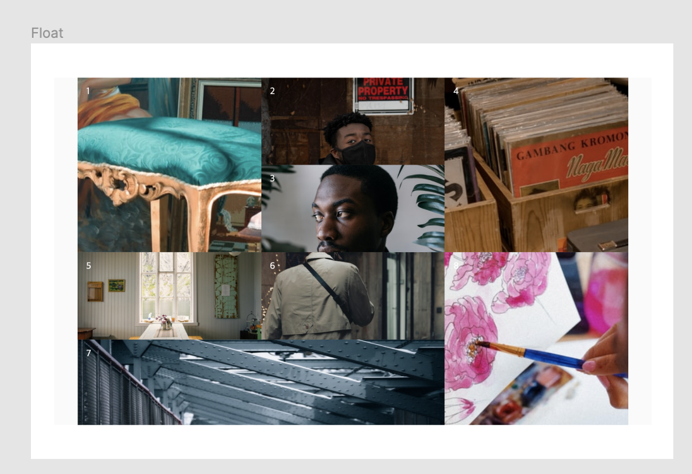

##  Case20 : Float

### 케이스 주제
[Figma](https://www.figma.com/file/kdW1tTk9WGwRQhhOf1RPx9/SecretCode-Float-and-Position?node-id=0%3A1)에서 제공되는 화면을 확인하여 float 레이아웃 갤러리를 만듭니다. 
아래의 요구사항을 참고해서 모든 브라우저에서 같은 디자인이 보이도록 해야합니다.

### 기능 요구사항
1. [example.png](./example.png)를 확인하여 레이아웃을 Float으로 구성합니다.
2. 각 박스의 높이는 300px(큰 박스), 150px(작은 박스)가 적절히 섞이도록 구성해야 합니다.
3. 박스의 순서는 figma를 확인해주세요.

### 문제
[👩🏻‍🎨 Figma에서 확인하기](https://www.figma.com/file/kdW1tTk9WGwRQhhOf1RPx9/SecretCode-Float-and-Position?node-id=0%3A1) 
 

### 주요 학습 키워드
- float으로 갤러리 레이아웃 만들기
- float 해제 및 필요한 곳에만 HTML 및 CSS 사용하기
- float으로 다양한 브라우저에서도 같은 레이아웃 만들기

### 작성해주셔야 하는 question 파일경로
`./question/question.html`
`./question/question.css`
`./question/question.scss`

### 실행 방법
경로
`./question/question.html`
index.html 열기