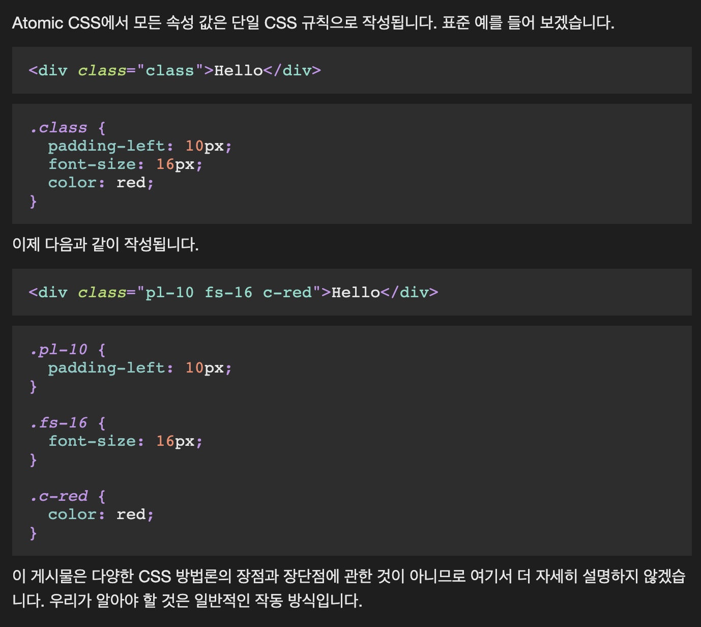
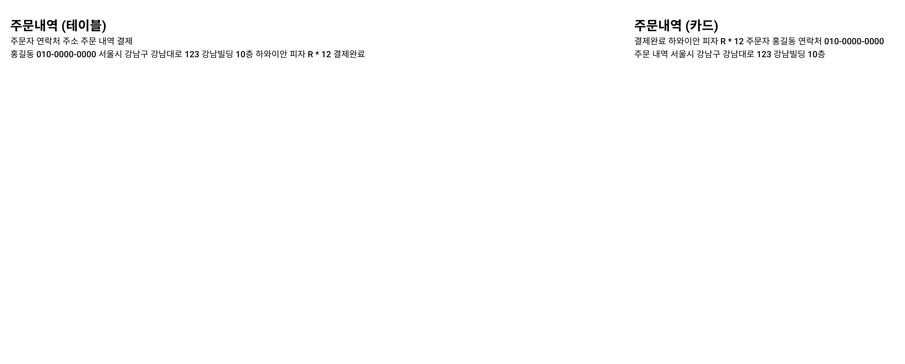
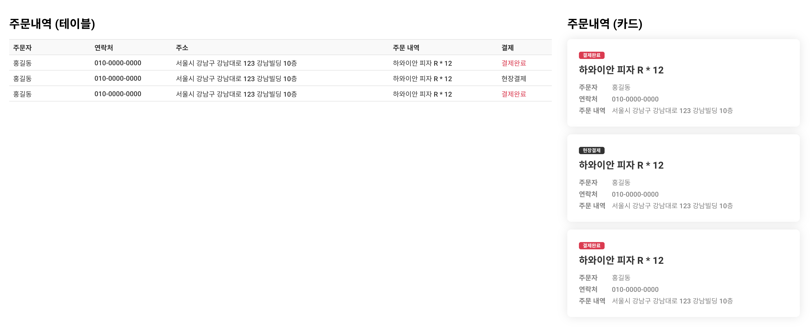

## Case23 : Atomic CSS

### 케이스 주제
case13에서 다뤘던 `테이블`, `카드`의 마크업을 `Atomic CSS`로 구현해봅니다. 
Atomic CSS(혹은 Functional CSS)의 개념을 가장 간단하고 잘 설명한 [링크](https://weser.io/blog/the-shorthand-longhand-problem-in-atomic-css) 입니다. 
 

`반응형은 고려하지 않고` 테이블과 카드를 `각각` 만들어주세요. 
기존의 방식이 시멘틱한 클래스명을 짓고 여러 스타일을 넣는 방식이었다면, 
기능 기반의 CSS 셀렉터를 만들어 사용해 보는 것이 이번 케이스의 목적입니다. 
디자인에서 사용되는 스타일을 기능별로 클래스명으로 만들어 사용해보세요.

 

### 주요 학습 키워드
- Atomic CSS
- Functional CSS
- Tailwind CSS

 

### 참고용 디자인
[👩🏻‍🎨 Figma에서 확인하기](https://www.figma.com/file/9FXkniEMPgZKtJY4GwP60z/SecretCode?node-id=143%3A95) 

이렇게 기본 마크업이 생성되어있습니다. Atomic CSS를 생성한 뒤, 클래스명을 알맞게 넣어주세요.
 

 예상 결과물은 아래와 같습니다.
 

 

### 작성해주셔야 하는 question 파일경로
`./question/question.html`
`./question/question.scss`

 

### 실행 방법
경로 `./question/question.html` question.html 열기
