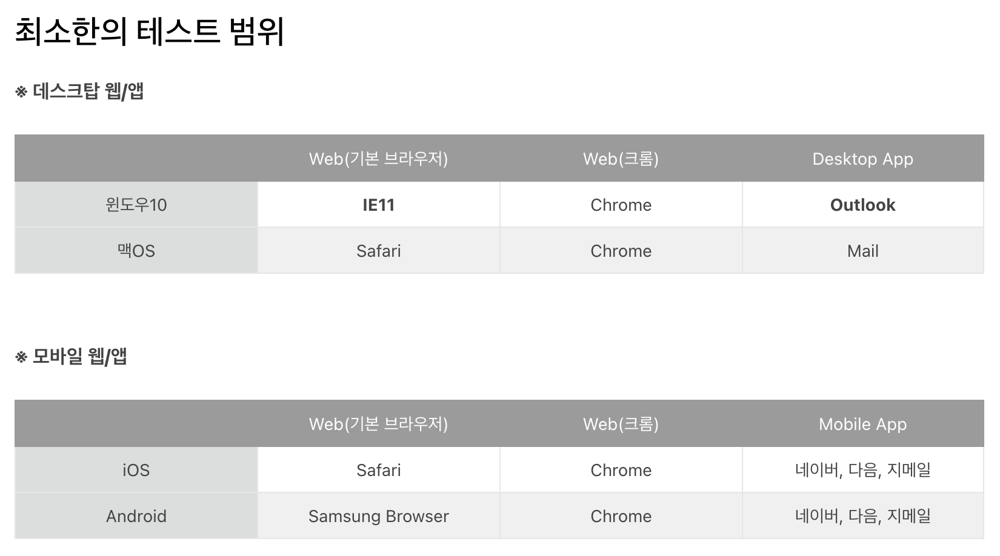
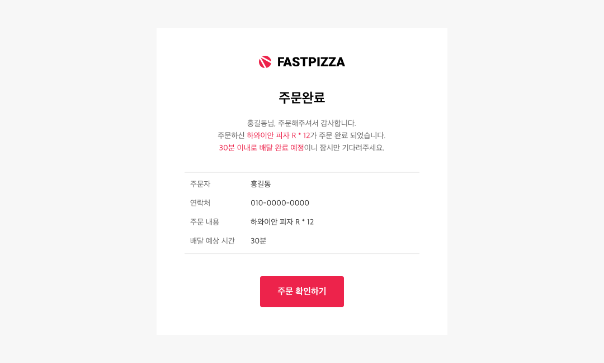
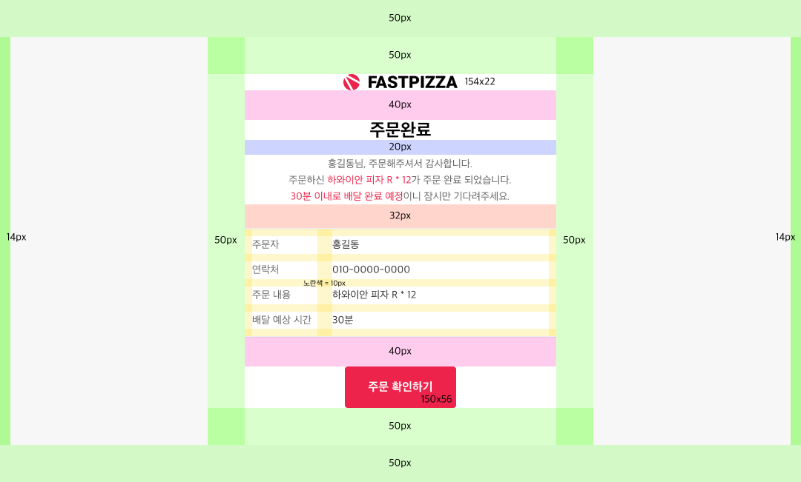
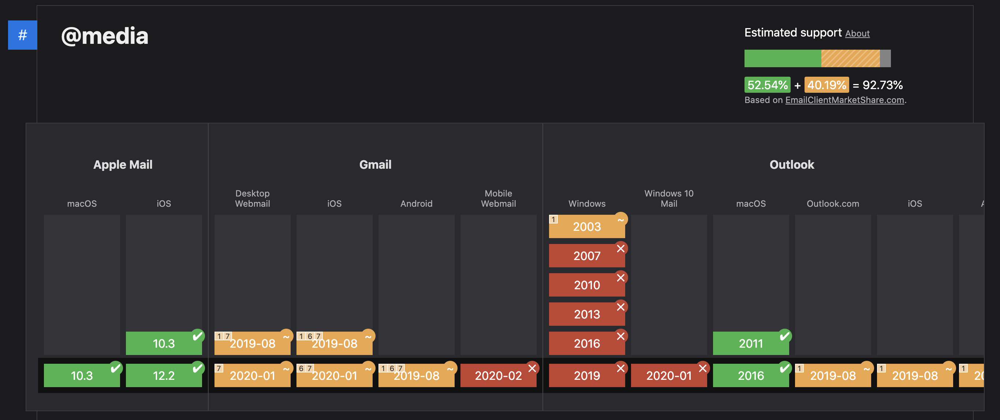
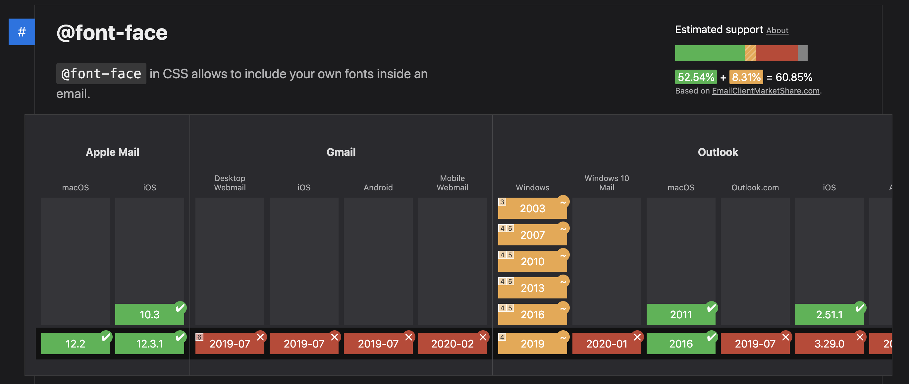

## Case26 : Email Template

### 케이스 주제
이메일 클라이언트 환경에 맞춰 이메일 템플릿을 제작해봅니다.
이는 이메일 서명 마크업에도 동일하게 적용됩니다.

<br>

### 기능 요구사항
1. 디자인에 요구된 화면을 이메일 템플릿으로 구현한다.
1. 다양한 이메일 클라이언트 환경에서 최대한 비슷한 디자인을 구현한다.
1. 다크 모드 환경에서 이미지나 텍스트의 가시성도 고려해주세요.

<br>

### 보충 설명
현업에서 일하기 전까지는 예상하지 못한 케이스가 바로 이메일 템플릿을 제작하는 것입니다. 마케팅 툴로 별도로 제작해서 발송하는 경우도 있지만, 기본적인 회원가입/로그인/비밀번호 찾기 이메일부터 결제/환불 등 자사가 서비스하는 내용을 담은 이메일은 직접 템플릿을 개발해서 사용하는 경우가 빈번합니다. 이메일 클라이언트 환경에서는 웹 페이지를 제작하듯이 만들 수 없기 때문에 이메일 템플릿 개발에 맞춰 따로 제작해야 합니다. 이번 케이스에서는 그 과정을 다루어 봅니다.

이메일 클라이언트 환경은 굉장히 다양하기 때문에 100% 똑같이 구현할 수는 없지만 레이아웃이 무너지지 않는 정도는 필수로 챙겨져야 합니다. 권장하는 테스트 환경은 아래와 같습니다. 윈도우 IE11/Outlook 앱만 신경써서 확인하시면 다른 환경에서는 대부분 이슈 없을 겁니다. <br>

[Email Client Support Scoreboard](https://www.caniemail.com/scoreboard/)


<br>

### 문제
[👩🏻‍🎨 Figma에서 확인하기](https://www.figma.com/file/9FXkniEMPgZKtJY4GwP60z/SecretCode?node-id=388%3A72&viewport=479%2C645%2C0.7095826268196106)
 
 

<br>

### 주요 학습 키워드
- email markup

<br>

### 참고 링크: 호환성 확인
- [https://www.campaignmonitor.com/css/](https://www.campaignmonitor.com/css/)
- [https://www.caniemail.com/](https://www.caniemail.com/)
- [https://www.htmlemailcheck.com/](https://www.htmlemailcheck.com/)

<br>

### 작성해주셔야 하는 question 파일경로
`./question/question.html`
`./question/question.css`
`./question/question.scss`

<br>

### 실행 방법
경로
`./question/question.html`
index.html 열기


<br><br><hr><br>

## ✨ (필독) 이메일에서 안 되는 것들 ✨

### ❌ 미디어쿼리 (반응형)
자연스럽게 가로폭이 줄어드는 것 외에 모든 반응형 제어가 불가합니다. 미디어쿼리는 윈도우 기반의 메일 클라이언트들에서 대부분 지원하지 않아 호환성의 이슈로 사용하지 않습니다. 


[https://www.caniemail.com/search/?s=%40media](https://www.caniemail.com/search/?s=%40media)

**PC → Mobile로 화면이 줄어들 때**
- 레이아웃이 (2단 → 1단) 변경 ❌ 
- 특정 워딩에서 개행 ❌ 
    - pc (인생을 바꾸는 교육, 패스트캠퍼스.) → m (인생을 바꾸는 교육,/ 패스트캠퍼스) ❌ 
        - 자연스러운 가로폭 감소에 의한 개행이 아닌 임의 개행 불가

<br>

### ❌ 웹 폰트

이메일 클라이언트에서는 웹폰트를 사용할 수 없습니다. 따라서 기본 폰트셋은 시스템 기본 폰트를 우선 적용합니다. 

```css
font-family: BlinkMacSystemFont, 'Apple SD Gothic Neo', '맑은 고딕', sans-serif;
```

[https://www.caniemail.com/search/?s=font](https://www.caniemail.com/search/?s=font)

<br>

### ❌ 색상값 opacity 조정 불가

```css
color: rgba(0, 0, 0, 0.2); // ❌ 사용불가
color: #222; // ✅ 사용가능 (정확한 hex 값을 넣어주세요)
```
[https://www.campaignmonitor.com/css/color-background/rgba-colors/](https://www.campaignmonitor.com/css/color-background/rgba-colors/)