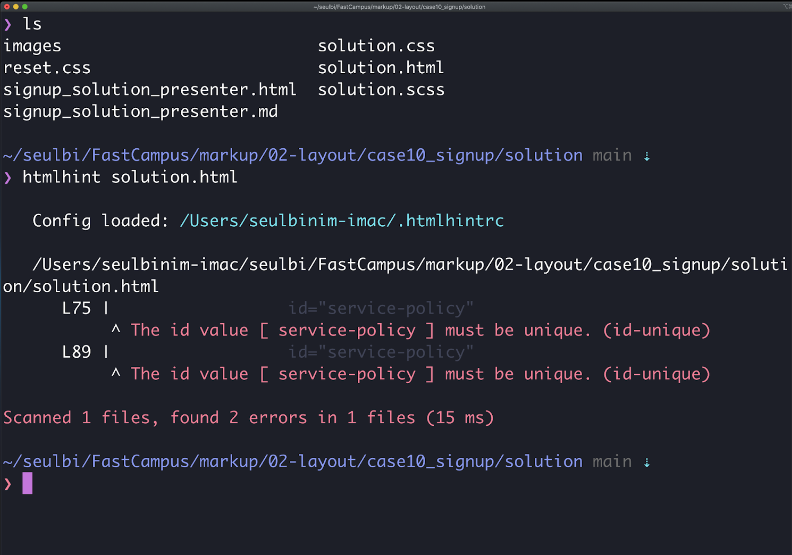

## Case10 : Signup - 출제자 해설코드


```html
<!DOCTYPE html>
<html lang="en">
  <head>
    <meta charset="UTF-8" />
    <meta name="viewport" content="width=device-width, initial-scale=1.0" />
    <title>04-signup (solution)</title>
    <link
      href="https://fonts.googleapis.com/css2?family=Noto+Sans+KR:wght@400;700&display=swap"
      rel="stylesheet"
    />
    <link rel="stylesheet" href="reset.css" />
    <link rel="stylesheet" href="solution.css" />
  </head>
  <body>
    <div class="signup-container">
      <div class="signup">
        <div class="signup-logo">
          
        </div>
        <h1 class="signup-title">
          인생을 바꾸는 교육,<br />
          패스트 캠퍼스.
        </h1>

        <form class="signup-form-container">
          <div class="signup-form-input-container">
            <input type="text" class="signup-form-input" placeholder="이름" />
            <div class="signup-form-email-row">
              <input
                type="email"
                class="signup-form-input"
                placeholder="이메일"
              />
              <button class="signup-form-send-validation-email-button">
                인증메일 발송
              </button>
            </div>
            <input
              type="tel"
              class="signup-form-input"
              placeholder="휴대폰 번호 (숫자만)"
            />
            <input
              type="password"
              class="signup-form-input"
              placeholder="비밀번호"
            />
            <input
              type="password"
              class="signup-form-input"
              placeholder="비밀번호 확인"
            />
          </div>

          <div class="signup-option-container">
            <div class="signup-option-row">
              <div class="signup-form-checkbox-container">
                <input
                  type="checkbox"
                  class="signup-form-checkbox"
                  id="service-policy"
                />
                <label for="service-policy" class="signup-form-checkbox-label">
                  서비스 이용약관 동의 (필수)
                </label>
              </div>
              <a href="#" class="signup-option-policy-link">보기</a>
            </div>

            <div class="signup-option-row">
              <div class="signup-form-checkbox-container">
                <input
                  type="checkbox"
                  class="signup-form-checkbox"
                  id="service-policy"
                />
                <label for="service-policy" class="signup-form-checkbox-label">
                  개인정보 처리방침 동의 (필수)
                </label>
              </div>
              <a href="#" class="signup-option-policy-link">보기</a>
            </div>

            <div class="signup-option-row">
              <div class="signup-form-checkbox-container">
                <input
                  type="checkbox"
                  class="signup-form-checkbox"
                  id="service-policy"
                />
                <label for="service-policy" class="signup-form-checkbox-label">
                  패스트캠퍼스의 소식과 다양한 안내 (선택)
                </label>
              </div>
              <a href="#" class="signup-option-policy-link">보기</a>
            </div>
          </div>

          <div class="signup-button-container">
            <button class="signup-button">회원가입</button>
          </div>
        </form>
      </div>
    </div>
  </body>
</html>

```

```scss
// figma : https://www.figma.com/file/9FXkniEMPgZKtJY4GwP60z/Input?node-id=0%3A3

// color palette
$gray1: #333333;
$gray2: #4f4f4f;
$gray3: #828282;
$gray4: #bdbdbd;
$gray5: #e0e0e0;
$gray6: #f2f2f2;
$gray7: #f9f9f9;
$primary: #ed234b;

// color variable rename
$text-color: $gray1;
$input-text-color: $gray2;
$text-link-color: $gray4;
$placeholder-text-color: $gray4;
$border-color: $gray5;
$border-focus-color: $gray1;
$button-primary-color: $primary;
$button-gray-color: $gray2;

// default
html,
body {
  font-family: "Noto Sans KR", sans-serif;
  font-size: 14px;
  line-height: 20px;
  color: $text-color;
}

.signup-container {
  display: flex;
  justify-content: center;
  align-items: center;
  height: 100vh;

  .signup {
    border: 1px solid $border-color;
    border-radius: 8px;
    padding: 60px 50px;
    width: 100%;
    max-width: 500px;

    .signup-title {
      font-size: 30px;
      color: black;
      line-height: 43px;
      margin: 16px 0 56px;
    }

    .signup-form-container {
      display: flex;
      flex-direction: column;

      .signup-form-input-container {
        display: flex;
        flex-direction: column;

        .signup-form-input {
          border: 1px solid $border-color;
          border-radius: 4px;
          padding: 16px;
          color: $input-text-color;
          outline: none;
          width: 100%;

          &::placeholder {
            color: $placeholder-text-color;
          }

          &:focus {
            border: 1px solid $border-focus-color;
          }

          &:not(:last-child) {
            margin-bottom: 12px;
          }
        }

        .signup-form-email-row {
          display: flex;

          .signup-form-send-validation-email-button {
            padding: 16px;
            background: $button-gray-color;
            border-radius: 4px;
            border: none;
            color: white;
            margin-left: 8px;
            min-width: max-content;
            height: 48px;
            outline: none;
          }
        }
      }

      .signup-option-container {
        display: flex;
        flex-direction: column;
        justify-content: space-between;
        margin: 18px 0 42px;

        .signup-option-row {
          width: 100%;
          display: flex;
          justify-content: space-between;
          align-items: center;

          &:not(:last-child) {
            margin-bottom: 12px;
          }

          .signup-option-policy-link {
            font-size: 12px;
            color: $text-link-color;
          }
        }

        // 기본 HTML 체크박스 대신 이미지 활용
        .signup-form-checkbox-container {
          .signup-form-checkbox {
            display: none;

            + label {
              background: url("./images/checkbox-default.png") no-repeat;
              height: 16px;
              display: inline-block;
              padding-left: 22px;
              line-height: 16px;
            }

            &:checked + label {
              background: url("./images/checkbox-checked.png") no-repeat;
            }
          }
        }
      }

      .signup-button-container {
        .signup-button {
          width: 100%;
          height: 48px;
          line-height: 48px;
          color: white;
          border: none;
          border-radius: 4px;
          font-size: 16px;
          background: $button-primary-color;
          font-weight: bold;
          outline: none;
        }
      }
    }
  }
}

@media screen and (max-width: 769px) {
  .signup-container {
    align-items: flex-start;

    .signup {
      border: none;
      padding: 40px 20px;

      .signup-title {
        font-size: 24px;
        line-height: 35px;
        margin: 16px 0 40px;
      }
    }
  }
}

```

### < Case10 : Sign up > 문제와 같이 보면 좋은 팁
다른강사님께서 해당 출제문제를 본 후, 같이 확인하면 좋겠다고 주신 의견입니다.

#### HTML
회원가입과 같은 웹페이지에는 `<input>` 요소가 많이 사용되고 있습니다. 이때 아이디 또는 이메일 주소 그리고 비밀번호 등이 기본적으로 요구되는 값의 유형일 것입니다.

이런 유형의 경우 일번적인 아이디는 type=”text”, 이메일 유형의 아이디는 type=”email”, 비밀번호는 type=”password”를 사용하는 것이 좋습니다.

특히 type=”email” 유형의 경우 HTML5에 새롭게 등장한 값으로 입력 값이 이메일 형식이 아니면 오류 메시지를 보여줍니다.

`<input>` 요소나 type=”email” 값의 경우 자세한 설명이나 사용 사럐는 아래 MDN을 참고하시기 바랍니다.
https://developer.mozilla.org/ko/docs/Web/HTML/Element/Input 
https://developer.mozilla.org/en-US/docs/Web/HTML/Element/input/email 

또한 입력 값이 필수인지 아닌지 이해할 수 있도록 HTML5의 required 속성을 사용하는 것도 도움이 될 수 있습니다.
만약 required 속성을 사용하지 못하는 상황이라면 스크린리더 사용자들이 해당 입력 값이 필수임을 인지할 수 있도록 aria-required 속성을 사용하는 것이 도움이 됩니다.

대다수의 개발자들이 해당 정보가 필수임을 시각적으로만 표현하려 하지만 화면을 볼 수 없는 보조기기 등의 사용자를 고려하여 프로그래밍 적 해결책을 찾는 것 또한 중요할 수 있다는 점을 잊지 마시기 바랍니다.

https://www.w3.org/TR/WCAG20-TECHS/ARIA2.html 
https://developer.mozilla.org/en-US/docs/Web/Accessibility/ARIA/ARIA_Techniques/Using_the_aria-required_attribute 

HTML에 문법 오류가 발견되고 있습니다. id 사용의 경우 문서에서 중복된 이름을 사용할 수 없는데 현재 signup.html의 약관 관련한 체크박스에 service-policy라는 동일한 아이디를 사용하고 있어 문제가 있습니다. 이 경우 사용자는 여려개의 체크박스 중 하나만 선택할 수 있게 됩니다. 

이런 오류를 문서단위로 검증하고자 할 경우 https://validator.w3.org/ 를 활용하시거나
htmlhint라는 node의 패키지를 설치해서 검증해 보는 것이 필요합니다.

htmlhint의 경우 특정 폴더 내 모든 HTML파일에 대한 일괄 검수도 가능합니다.
일괄 검수 시 명령어는 다음과 같습니다.
```
htmlhint **/*.html
```

아래는 CLI 환경에서 htmlhint로 검사해 본 signup.html 파일의 결과입니다.


#### CSS
체크박스와 같은 경우 대다수 커스텀 디자인을 선호합니다.
디자인 시안을 바탕으로 구현하기 위해서는 체크박스 커스텀이 필수일 수 있습니다.

다만 디자인에만 초점을 맞추다보면 키보드 접근이 불가한 경우를 종종 볼 수 있는데 이는 웹접근성 관점을 고려하지 않은 제작 방식이라 할 수 있습니다. 

커스텀 체크박스 디자인의 핵샘은 체크박스 입력서식인 `<input>` 요소에 display: none을 적용하지 않는 것입니다.

많은 개발자가 `<input>` 요소에 display: none;을 적용한 후 `<label>` 등의 요소에 커스텀 체크박스를 배경이미지로 사용합니다. 그러나 이렇게 개발할 경우 키보드 접근과 조작 자체가 불가능해 집니다.

그렇다면 어떤 방법을 사용하면 키보드로도 접근 및 조작 가능한 커스텀 체크박스를 만들 수 있을까요?
`<input>` 요소에 display: none 대신 다음과 같은 트릭을 활용할 수 있습니다.
```css
.signup-form-checkbox {
  opacity: 0;
  width: 16px;
  height: 16px;
  padding: 0;
  position: absolute;
  z-index: 100;
  background: transparent;
  cursor: pointer;
}
```
이제 키보드로 접근하여 스페이스 키를 눌러보면 `<label>` 요소에 미리 적용된 배경이미지가 변경되는 것을 확인할 수 있습니다.

그렇지만 여기서도 문제가 발생합니다. 

아이디나 비밀번화 같은 입력서식과 달리 체크박스 입력서식은 opacity: 0을 지정했기 때문에 키보드가 접근하긴 하지만 포커스가 시각적으로 표시되지 않습니다.

이 문제를 해결하기 위해 .signup-form-checkbox:focus + label 요소를 선택자로 활용하여 아웃라인 디자인을 추가할 수 있습니다.

다만 이 경우 레이블 전체에 아웃라인이 발생하기 때문에 체크박스 배경에만 적용하고자 할 경우 배경이미지를 `<label>` 요소 자체가 아닌 다른 요소에 적용하는 것이 도움이 됩니다. 

다른 요소에 배경을 적용할 때 아래와 같은 형태의 마크업을 구성하여 문제를 해결해 보시기 바랍니다.
```html
<div class="signup-form-checkbox-container">
  <input
    type="checkbox"
    class="signup-form-checkbox"
    id="service-policy"
  />
  <span class="custom-checkbox"></span>
  <label for="service-policy" class="signup-form-checkbox-label">
    개인정보 처리방침 동의 (필수)
  </label>
</div>
```
간혹 실무에서 커스텀 체크박스 제작을 위해 `<input>` 요소가 아닌 `<span>` 등의 요소를 사용하는 경우가 있습니다.<br />이 경우 키보드 접근을 위해 tabindex=”0과 ”WAI-ARIA의 role=”checkbox”를 활용하여 키보드 사용자나 보조기기 사용자가 이를 이해하고 조작하게 할 수도 있습니다.

그러나 `<input>`이 아닌 `<span>` 등의 요소를 사용할 경우 입력값에 대한 처리나 마우스 및 키보드 관련 조작 기능을 모두 자바스크립트에서 처리를 해야한다는 것을 기억하시기 바랍니다. 

role=”checkbox”에 대한 참고사이트는 MDN을 살펴보시기 바랍니다.
https://developer.mozilla.org/en-US/docs/Web/Accessibility/ARIA/Roles/checkbox_role

CSS 빌드 결과물의 선택자가 너무 복잡한것 같습니다.
이렇게 복잡한 선택자를 사용하면 추후 CSS를 재정의 해야하는 상황에서 문제를 일으킬 소지가 있습니다.

Sass는 이를 방지하기 위해 효율적으로 중첩패턴을 사용할 수 있는 & 지시자가 있기때문에 이를 잘 활용하여 재사용이나 확장 가능한 코드를 짜는 것이 필요합니다.

예를들어 다음과 같은 방식으로 수정하면 좋을 것 같습니다.
```scss
// 중첩 패턴 BAD Case
.signup{
 .signup-container{
   ...
 }
 .signup-form-input{
   ...
 }
}
 
// 중첩 패턴 GOOD Case
.signup{
 &-container{
   ...
 }
 &-form-input{
   ...
 }
}
```

그리고 미디어쿼리를 사용할 경우 지금 처럼 모든 디바이스에 적용될 코드를 선언한 후 모바일 디바이스에서 재정의하는 방식은 모바일 최적화 관점에서는 좋지 않을 수 있습니다. 
이미 모바일에서 모든 코드를 적용한 후 다시 또 재정의 한 코드를 해석해서 다시 적용해야 하니까요.
이럴 땐, 아래와 같이 하나의 선택자 내부에서 미디어쿼리 믹스인을 호출하는 방식도 사용해볼 수 있습니다.

```scss
.signup-container {
 // 모든 디바이스 공통
 display: flex;
 justify-content: center;
 height: 100vh;
 
 // 모바일 디바이스
 @include mobile{
   align-items: flex-start
 }
 
 // 데스크탑 디바이스
 @include desktop{
   align-items: center;
 }
}
```