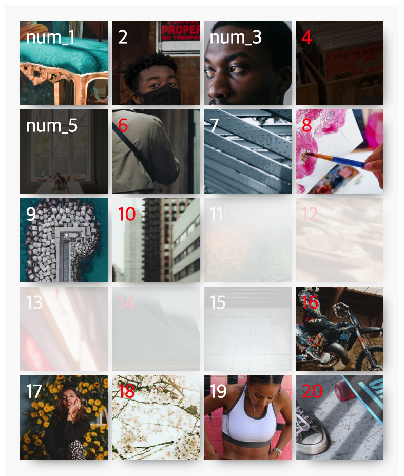

## Case17 : nth-child

### 케이스 주제

[Figma](https://www.figma.com/file/ivGBWEgbLA0OAGSuUrzE7P/SecretCode-nth-child?node-id=0%3A1)에서 제공되는 화면을 확인하여 nth-child에 대해서 이해해 봅니다. 
nth-of-type과의 차이도 알아보세요. 
아래의 요구사항을 참고해서 모든 브라우저에서 같은 디자인이 보이도록 해야합니다.

### 기능 요구사항

1. 레이아웃을 잡는 속성은 float을 사용해주세요.
2. float인 상태에서 반응형에 따라서 item들 사이의 여백을 조절해주세요.
3. 지정된 브라우저 해상도(table(1024px), pablet(767px), mobile(480px))에 따라서 아이템의 컬럼 수를 4개, 3개, 2개, 1개로 줄여가면서 반응형을 완성해주세요.
4. 박스의 순서는 figma를 확인해주세요.
5. 이미지와 같이 스타일링 해주세요
   1. 4번째부터 시작하여 2번째마다 컬러를 red로 지정해주세요. (4,6,8,10,12...)
      1. nth-of-type도 지정하여 어떻게 다른지 확인해보세요.
   2. 첫번째 요소부터 5번째 요소까지 2개 마다 content를 'num\_숫자'로 텍스트를 지정해주세요. ('num_1', 2,'num_3',4,'num_5',6...)
      1. nth-of-type도 지정하여 어떻게 다른지 확인해보세요.
   3. 4번째 이미지에 대해서 nth-child로 dimmed를 적용해주시고 5번째 이미지에 대해서 nth-of-type을 사용해서 dimmed]를 적용해주세요. (background: rgba(0,0,0,0.7))
   4. 선택자 결합을 통해서 교집합을 만들어 11번부터 15번까지 image에 opacity:0.2를 주세요

### 문제

[👩🏻‍🎨 Figma에서 확인하기](https://www.figma.com/file/ivGBWEgbLA0OAGSuUrzE7P/SecretCode-nth-child?node-id=0%3A1) 

### 주요 학습 키워드

- nth-child 이해하기
- nth-child를 사용해서 반응형 레이아웃에 따른 아이템 컬럼 개수 조절하기
- nth-child와 nth-of-type 차이 이해하기

### 작성해주셔야 하는 question 파일경로

`./question/question.css`
`./question/question.scss`

### 실행 방법

경로
`./question/question.html`
index.html 열기
