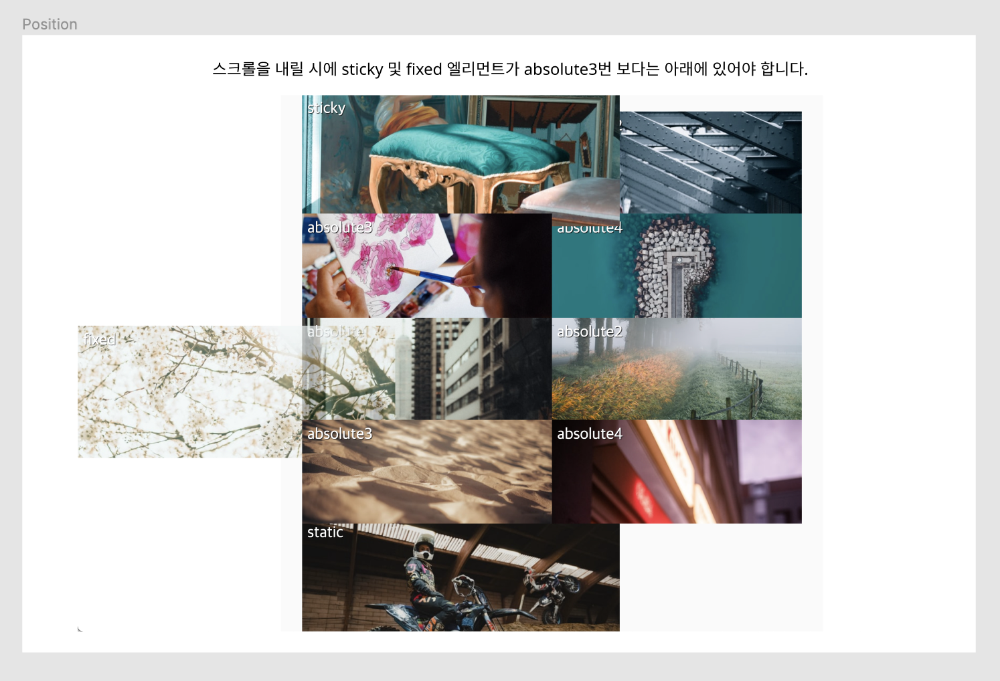

##  Case19 : Position

### 케이스 주제
[Figma](https://www.figma.com/file/kdW1tTk9WGwRQhhOf1RPx9/SecretCode-Float-and-Position?node-id=0%3A1)에서 제공되는 화면을 확인하여 position 레이아웃을 만듭니다. 
아래의 요구사항을 참고해서 모든 브라우저에서 같은 디자인이 보이도록 해야합니다.

### 기능 요구사항
1. [example.png](./example.png)를 확인하여 레이아웃을 Position으로 구성합니다.
2. relative 엘리먼트의 41.25%는 화면이 줄어도 비율이 일정하게 하기 위함입니다.
3. 박스의 순서는 figma를 확인해주세요.
4. 스크롤을 내릴 시에 sticky 및 fixed 엘리먼트가 absolute3번 보다는 아래에 있어야 합니다.
5. HTML파일 내에 div 태그에 적절히 position과 관련된 클래스를 부여하여 CSS로 제어해보세요.

### 문제
[👩🏻‍🎨 Figma에서 확인하기](https://www.figma.com/file/kdW1tTk9WGwRQhhOf1RPx9/SecretCode-Float-and-Position?node-id=0%3A1) 
 

### 주요 학습 키워드
- position으로 비율이 일정한 레이아웃 만들기
- static, relative, absolute, sticky 사용해 보기
- z-index를 적절히 사용하여 레이아웃이 쌓이는 기준점 파악하기

### 작성해주셔야 하는 question 파일경로
`./question/question.html`
`./question/question.css`
`./question/question.scss`

### 실행 방법
경로
`./question/question.html`
index.html 열기