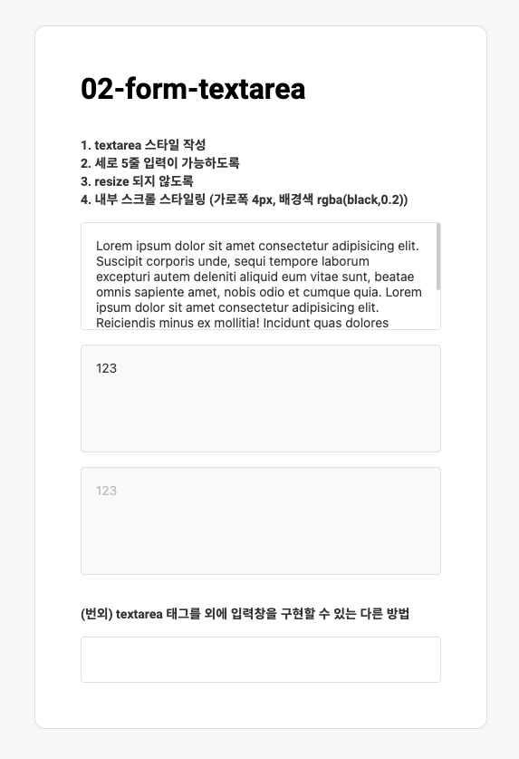

## Case2 : Textarea

### 케이스 주제
Form 요소 중 하나인 textarea 관련 문제입니다. 
[Figma](https://www.figma.com/file/9FXkniEMPgZKtJY4GwP60z/Input?node-id=0%3A1)에서 제공되는 수치를 확인해서 디자인과 같은 스타일을 작성합니다. 
아래의 요구사항을 참고해서 모든 브라우저에서 같은 디자인이 보이도록 해야합니다.

 

### 기능 요구사항
1. `input` 스타일 코드를 활용하여 기본 `textarea` 스타일을 작성해주세요. 
    1. `hover`했을 경우 테두리색이 변경됩니다.
        - readonly, disabled 일 때는 hover가 되더라도 스타일이 변경되지 않도록 해주세요.
    1. `focus`되었을 경우 테두리색이 변경됩니다. 
        - readonly, disabled 일 때는 focus가 되더라도 스타일이 변경되지 않도록 해주세요.
    1. `readonly`의 경우 배경색이 바뀝니다.
    1. `disabled`의 경우 배경색과 글자색이 바뀝니다.
1. 세로 5줄 입력이 가능하도록 높이값을 지정해주세요.
1. `textarea`가 `resize` 되지 않도록 해주세요.
1. `textarea` 내부 스크롤 스타일을 변경
    - width: 4px
    - border-radius: 2px
    - background-color: rgba(black, 0.2)
1. (번외) `textarea` 태그를 사용하지 않고도 입력창을 구현할 수 있는 다른 방법을 찾아보세요. 

 

### 문제
[👩🏻‍🎨 Figma에서 확인하기](https://www.figma.com/file/9FXkniEMPgZKtJY4GwP60z/Input?node-id=0%3A1) 
 

 

### 주요 학습 키워드
- textarea 스타일 적용
- textarea의 기본적인 속성들 사용해보기

 

### 작성해주셔야 하는 question 파일경로
`./question/question.html`
`./question/question.scss`

 

### 실행 방법
경로
`./question/question.html`
question.html 열기