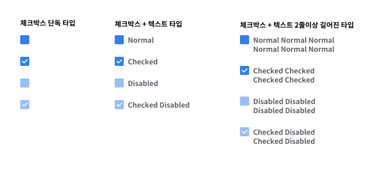
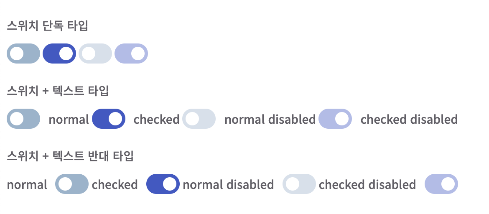

## Case3 : checkbox & switch(toggle)

### 케이스주제
폼태그 중 `체크박스`사용하기 & 체크박스를 이용한 `스위치(토글) 버튼` 문제

### 기능 요구사항
#### checkbox
1. 해당 스프라이트를 이용한 `단독 체크박스` 타입 작성
    - normal 타입
    - checked 타입
    - disabled 타입
    - checked & disabled 타입
2. 해당 스프라이트를 이용한 `체크박스 + 텍스트` 타입 작성
    - normal 타입
    - checked 타입
    - disabled 타입
    - checked & disabled 타입
3. 해당 스프라이트를 이용한 `체크박스 + 텍스트 2줄이상 길어질 경우` 타입 작성
4. 체크박스 옆의 텍스트를 선택해도 css만으로 checked/unchecked 기능 구현
    - 체크박스 디자인 변화되도록 스타일 작성
#### switch
1. `단독 스위치` 타입 작성
    - OFF 타입
    - ON 타입
    - OFF & disabled 타입
    - ON & disabled 타입
2. `스위치 + 텍스트` 타입 작성
    - OFF 타입
    - ON 타입
    - OFF & disabled 타입
    - ON & disabled 타입
3. `텍스트 + 스위치`로 반대의 경우 타입 작성

### 문제

### 주요 학습 키워드
- 주어진 체크박스 스프라이트로 체크박스 스타일 적용
- 체크박스의 기본적인 상태속성들 사용
- 웹접근성을 위한 input 초점 시각화
- 웹접근성을 위한 label요소 클릭시, 해당 input 동작
- 체크박스를 사용한 스위치(토글) 버튼 구현
- 스위치 on/off 애니메이션 효과
- 마크업구조가 동일한 상태에서 반대 타입 구현

### 작성해주셔야 하는 question 파일경로
#### checkbox
`./question/case3-1_checkbox/html/checkbox.html`
`./question/case3-1_checkbox/scss/checkbox.scss`

#### switch
`./question/case3-2_switch/html/switch.html`
`./question/case3-2_switch/scss/switch.scss`

### 실행 방법
#### checkbox
경로 `./question/case3-1_checkbox/html/checkbox.html` checkbox.html 열기
`.question/case3-1_checkbox/iamges/ico_comm.png` 스프라이트 이용

#### switch
경로 `./question/case3-2_switch/html/switch.html` switch.html 열기